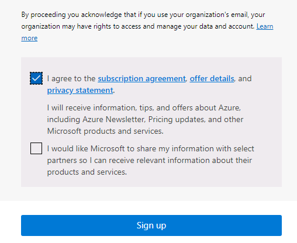

---
lab:
  title: 00 – Lab-Setup
  learning path: '01'
  module: Module 01 - Implement an identity management solution
---

# Lab 00: Setup der Labumgebung

## Labszenario

Sie müssen ein neues Azure-Abonnement erstellen und eine Azure AD P2-Lizenz anfordern, damit Sie die anstehenden Labs absolvieren können.

#### Geschätzte Dauer: 5 Minuten

## Erstellen eines Azure-Kontos und Hinzufügen von Azure Active Directory Premium P2-Testlizenzen

Für die Aufgaben in dieser Übung und die Übungen in diesem Lernpfad allgemein wird ein vorhandenes Azure-Abonnement benötigt. Sie können sich aber auch für ein kostenloses Azure-Testkonto registrieren. Wenn Sie bereits über ein eigenes Azure-Abonnement verfügen, können Sie diese Aufgabe überspringen und mit der nächsten fortfahren.

1. Rufen Sie in einem Webbrowser [https://azure.microsoft.com/free](https://azure.microsoft.com/free) auf.

1. Scrollen Sie auf der Seite nach unten, um weitere Informationen zu den Vorteilen und kostenlosen Diensten zu erhalten.

1. Wählen Sie die Option **Kostenlos starten** aus.

1. Verwenden Sie den Assistenten, um sich für ein Azure-Testabonnement zu registrieren.

1. Für einige der Übungen benötigen Sie eine P2-Lizenz für Azure AD. Suchen Sie in der erstellten Organisation nach **Azure Active Directory**, und wählen Sie den Dienst aus.

1. Wählen Sie im Navigationsmenü auf der linken Seite **Erste Schritte** aus.

1. Wählen Sie unter „Erste Schritte mit Azure AD“ die Option **Kostenlose Testversion für Azure AD Premium anfordern** aus.

1. Wählen Sie im Bereich „Aktivieren“ unter **AZURE AD PREMIUM P2** die Option **Kostenlose Testversion** und dann **Aktivieren** aus.

1. Wählen Sie im Navigationsmenü auf der linken Seite **Übersicht** aus.

1. Aktualisieren Sie den Browser, bis Azure AD Premium P2 unter dem Namen der Organisation angezeigt wird. Dies dauert einige Minuten.

1. Möglicherweise müssen Sie sich abmelden und erneut bei Microsoft Azure anmelden, wenn die erwarteten Features nicht verfügbar sind.

#### Einlösen des Azure Pass

1. Öffnen Sie einen Browser, und navigieren Sie zu: [www.microsoftazurepass.com](https://www.microsoftazurepass.com).

1. Wir empfehlen Ihnen, alle Browser zu schließen und eine neue InPrivate-Browsersitzung zu öffnen. Sonst kann es vorkommen, dass andere gespeicherte Anmeldungen vorhanden sind, die während des Aktivierungsschritts zu Fehlern führen.

1. Wählen Sie die Schaltfläche **Start** aus, um zu beginnen.

1. Bestätigen Sie, dass der Benutzername mit dem Mandantenkonto des Lab-Anbieters identisch ist.

1. Geben Sie den Azure Pass-Gutscheincode in das Feld **Enter Promo code** ein. Und bestätigen Sie, dass Sie ein Mensch sind, falls angefordert. 

1. Geben Sie Adressinformationen in die **Profile**-Felder ein.
    - **Address line 1**: 1 Microsoft Way
    - **City**: Redmond
    - **State**: Washington
    - **ZIP code**: 98052

1. Aktivieren Sie das Kontrollkästchen, um der Abonnementvereinbarung zuzustimmen, und wählen Sie **Registrieren** aus.

    

1. Navigieren Sie zu [https://portal.azure.com](https://portal.azure.com), und melden Sie sich mit dem Konto eines globalen Administrators für das Verzeichnis an.

1. Navigieren Sie zu **Abonnements**, und bestätigen Sie, dass für **Azure Pass – Sponsorship** der Status **Aktiv** angezeigt wird. 
