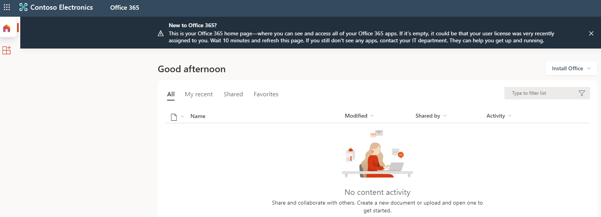

---
lab:
  title: '03: Zuweisen von Lizenzen mithilfe der Gruppenmitgliedschaft'
  learning path: '01'
  module: Module 01 - Implement an identity management solution
---

# Lab 03: Zuweisen von Lizenzen mithilfe der Gruppenmitgliedschaft

### Anmeldetyp = Microsoft 365 Admin

## Labszenario

Ihre Organisation hat sich entschieden, Sicherheitsgruppen in Microsoft Entra ID zum Verwalten von Lizenzen zu verwenden. Sie müssen eine neue Sicherheitsgruppe konfigurieren und dieser Gruppe eine Lizenz zuweisen und überprüfen, ob die Gruppenmitgliedslizenz aktualisiert wurde.

#### Geschätzte Dauer: 25 Minuten

### Übung 1: Erstellen einer Sicherheitsgruppe und Hinzufügen eines Benutzers

#### Aufgabe 1: Überprüfen, ob Delia Dennis Zugriff auf Office 365 hat

1. Öffnen Sie ein neues InPrivate-Browserfenster.
2. Stellen Sie eine Verbindung mit [https://www.office.com](https://www.office.com) her.
3. Wählen Sie „Anmelden“ und „Verbinden“ als Delia Dennis aus.

   | **Einstellung**| **Wert**|
   | :--- | :--- |
   | Benutzername | DeliaD@`your domain name.com`|
   | Kennwort| Geben Sie das Kennwort des globalen Administrators aus den Ressourcen ein.|

4. Sie sollten eine Verbindung mit der Office.com-Website herstellen, aber es wird eine Meldung angezeigt, die angibt, dass Sie keine Lizenz besitzen.

   
    
5. Schließen Sie das Browserfenster.

#### Aufgabe 2 – Erstellen einer Sicherheitsgruppe in Microsoft Entra ID

1. Navigieren Sie zu [https://entra.microsoft.com](https://entra.microsoft.com).

2. Erweitern Sie im linken Navigationsbereich unter **Identität** die Option **Gruppen**, und wählen Sie dann **Alle Gruppen** aus.
3. Wählen Sie auf der Seite „Gruppen“ im Menü die Option **Neue Gruppe** aus.
4. Erstellen Sie eine Gruppe mit den folgenden Informationen:

   | **Einstellung**| **Wert**|
   | :--- | :--- |
   | Gruppentyp| Sicherheit|
   | Gruppenname| sg-SC300-O365|
   | Mitgliedschaftstyp| Zugewiesen|
   | Besitzer| *Weisen Sie Ihr eigenes Administratorkonto als Gruppenbesitzer zu.*|

5. Wählen Sie unter „Mitglieder“ die Option **Keine Mitglieder ausgewählt** aus.
6. Wählen Sie in der Benutzerliste den Eintrag **Delia Dennis** aus.
7. Wählen Sie die Schaltfläche **Auswählen** aus.

   

8. Wählen Sie die Schaltfläche **Erstellen**.
9. Vergewissern Sie sich nach Abschluss des Vorgangs, dass die Gruppe namens **sg-SC300-O365** in der Liste **Alle Gruppen** angezeigt wird.

#### Aufgabe 3: Hinzufügen einer Office-Lizenz zu sg-SC300-O365

Sie müssen Lizenzen über das Microsoft 365 Admin Center hinzufügen und entfernen. Dies ist eine relativ neue Änderung.

1. Öffnen Sie eine neue Registerkarte in Ihrem Browser.

2. Verbinden Sie sich mit dem Microsoft 365 Admin Center unter http://admin.microsoft.com.

3. Melden Sie sich bei Aufforderung als Administratorkonto an.

4. Wählen Sie im Menü auf der linken Seite **Abrechnung** und dann **Lizenzen**.

5. Wählen Sie die **Office 365 E3**-Lizenz aus der Liste.

6. Wählen Sie auf dem Lizenzierungsbildschirm die Registerkarte **Gruppen** aus.

7. Wählen Sie das Element **+ Lizenz hinzufügen** aus.

8. Suchen Sie nach der Gruppe **sg-SC300-O365** und wählen Sie sie in der Liste aus.

8. Sobald Sie Raul hinzugefügt haben, wählen Sie **Zuweisen**.
 
9. Schließen Sie die Bestätigungsmeldung.

10. Kehren Sie zu der Browser-Registerkarte zurück, auf der **Microsoft Entra Admin Center** geöffnet ist.

11. Navigieren Sie zurück zu **Alle Gruppen** in der linken Navigation, unter **Identität** wählen Sie **Gruppen**.

12. Auf der Benutzerseite wählen Sie **sg-SC300-O365**.

13. Wählen Sie im linken Navigationsbereich **Lizenzen** aus.

14. Beachten Sie, dass die Office 365 E3-Lizenz zugewiesen wurde.

15. Sie können den Lizenzbildschirm nun verlassen.

#### Aufgabe 4: Bestätigen der Office 365-Lizenz

1. Öffnen Sie ein neues InPrivate-Browserfenster.
2. Stellen Sie eine Verbindung mit [https://www.office.com](https://www.office.com) her.
3. Wählen Sie „Anmelden“ und „Verbinden“ als Delia Dennis aus.

   | **Einstellung**| **Wert**|
   | :--- | :--- |
   | Benutzername | DeliaD@`your domain name.com`|
   | Kennwort| Geben Sie das Kennwort des globalen Administrators aus den Ressourcen ein.|

4. Es sollte eine Verbindung mit der Office.com-Website hergestellt und keine Meldungen zur Lizenz angezeigt werden. Alle Office-Anwendungen sind links verfügbar.

   
    
5. Schließen Sie das Browserfenster.

### Übung 2 – Erstellen einer Microsoft 365-Gruppe in Microsoft Entra ID

#### Aufgabe 1: Erstellen der Gruppe

Ein Teil Ihrer Aufgaben als Microsoft Entra-Administrator besteht darin, verschiedene Arten von Gruppen zu erstellen. Sie müssen eine neue Microsoft 365-Gruppe für die Vertriebsabteilung Ihrer Organisation erstellen.

1. Navigieren Sie zu [https://entra.microsoft.com]( https://entra.microsoft.com).

2. Erweitern Sie im linken Navigationsbereich unter **Identität** die Option **Gruppen**, und wählen Sie dann **Alle Gruppen** aus.

3. Wählen Sie auf der Seite „Gruppen“ im Menü die Option **Neue Gruppe** aus.

4. Erstellen Sie eine Gruppe mit den folgenden Informationen:

   | **Einstellung**| **Wert**|
   | :--- | :--- |
   | Gruppentyp| Microsoft 365|
   | Gruppenname| Northwest Sales|
   | Mitgliedschaftstyp| Zugewiesen|
   | Besitzer| *Weisen Sie Ihr eigenes Administratorkonto als Gruppenbesitzer zu.*|
   | Mitglieder| **Alex Wilber** und **Bianca Pisani**|

   

5. Vergewissern Sie sich nach Abschluss des Vorgangs, dass die Gruppe namens **Northwest Sales** in der Liste **Alle Gruppen** angezeigt wird.

### Übung 3: Erstellen einer dynamischen Gruppe mit allen Benutzern als Mitglieder

#### Aufgabe 1: Erstellen der dynamischen Gruppe

Wenn Ihr Unternehmen wächst, ist die manuelle Gruppenverwaltung zu zeitaufwändig. Seit der Standardisierung des Verzeichnisses können Sie jetzt dynamische Gruppen nutzen. Sie müssen eine neue dynamische Gruppe erstellen, damit Sie dynamische Gruppen in der Produktion erstellen können.

1. Melden Sie sich bei [https://entra.microsoft.com](https://entra.microsoft.com) mit einem Konto an, dem im Mandanten die Rolle „Globaler Administrator“ oder „Benutzeradministrator“ zugewiesen ist.

2. Wählen Sie **Identität** aus.

3. Wählen Sie unter **Gruppen** die Option **Alle Gruppen** und dann **Neue Gruppe** aus.

4. Wählen Sie auf der Seite Neue Gruppe unter **Gruppentyp** die Option **Sicherheit** aus.

5. Geben Sie im Feld **Gruppenname** die Bezeichnung **SC300-myDynamicGroup** ein.

6. Wählen Sie das Menü **Mitgliedschaftstyp** und dann **Dynamischer Benutzer** aus.

7. Wählen Sie einen **Besitzer** für die Gruppe aus.

7. Wählen Sie unter **Dynamische Mitglieder** die Option **Dynamische Abfrage hinzufügen** aus.

8. Wählen Sie auf der rechten Seite über dem Feld **Regelsyntax** die Option **Bearbeiten** aus.

9. Geben Sie im Bereich „Regelsyntax bearbeiten“ den folgenden Ausdruck in das Feld **Regelsyntax** ein:

   ```powershell
   user.objectid -ne null
   ```

   **Warnung**: die `user.objectid` berücksichtigt die Groß-/Kleinschreibung.

10. Wählen Sie **OK** aus. Die Regel wird im Feld „Regelsyntax“ angezeigt.

   

11. Wählen Sie **Speichern** aus. Die neue dynamische Gruppe enthält jetzt sowohl B2B-Gastbenutzer als auch Mitgliederbenutzer.

12. Wählen Sie auf der Seite „Neue Gruppe“ die Option **Erstellen** aus, um die Gruppe zu erstellen.

#### Aufgabe 2: Überprüfen, ob die Mitglieder hinzugefügt wurden

**Hinweis:** Das Füllen der dynamischen Gruppenmitgliedschaft kann bis zu 15 Minuten dauern.

1. Wählen Sie auf der **Startseite** `Microsoft Entra admin center` aus.
2. Starten Sie **Identität**.
3. Wählen Sie im Menü **Gruppen** die Option **Alle Gruppen** aus.
4. Geben Sie im Filterfeld **SC300** ein, und Ihre neu erstellte Gruppe wird aufgelistet.
5. Wählen Sie **SC300-myDynamicGroup** aus, um die Gruppe zu öffnen.
6. Beachten Sie die Anzeige, dass die Gruppe 30+ **Direkte Mitglieder* enthält.
7. Wählen Sie **Mitglieder** im Menü **Verwalten** aus.
8. Überprüfen Sie die Mitglieder.

#### Aufgabe 3: Experimentieren mit alternativen Regeln

1. Versuchen Sie, eine Gruppe nur mit **Gastbenutzern** zu erstellen:

   - (user.objectid -ne null) und (user.userType -eq "Guest")

2. Versuchen Sie, eine Gruppe nur mit **Mitgliedern** der Microsoft Entra-Benutzer zu erstellen.

   - (user.objectid -ne null) und (user.userType -eq "Member")
