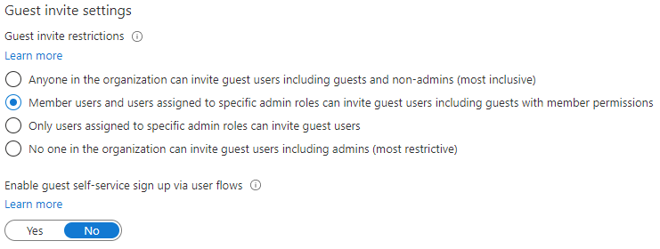

---
lab:
  title: '04: Konfigurieren der Einstellungen für externe Zusammenarbeit'
  learning path: '01'
  module: Module 01 - Implement an identity management solution
---

# Lab 04: Konfigurieren der Einstellungen für externe Zusammenarbeit

## Labszenario

Sie müssen die Einstellungen für die externe Zusammenarbeit für Ihre Organisation für den genehmigten Gastzugriff aktivieren.

#### Geschätzte Dauer: 5 Minuten

### Übung 1: Zulassen, dass Gastbenutzer in Ihre Organisation eingeladen werden

#### Aufgabe 1: Aktivieren der Self-Service-Registrierung von Gastbenutzern

1. Melden Sie sich bei [https://portal.azure.com](https://portal.azure.com) als Mandantenadministrator an.
2. Wählen Sie  **Azure Active Directory** aus.
3. Wählen Sie **Benutzereinstellungen** aus.
4. Wählen Sie **Manage external user collaboration settings** aus.
5. Stellen Sie sicher, dass **JA** für die Einstellung **Self-Service-Registrierung von Gästen über Benutzerflows aktivieren** aktiviert ist.
6. Wählen Sie **Speichern** am oberen Rand des Bildschirms aus.

#### Aufgabe 2: Konfigurieren der Einstellungen für externe Zusammenarbeit

1. Melden Sie sich bei [https://portal.azure.com](https://portal.azure.com) als Mandantenadministrator an.
2. Wählen Sie  **Azure Active Directory** aus.
3. Wählen Sie  **Externe Identitäten > Alle Identitätsanbieter** aus.
4. Wählen Sie den Benachrichtigungslink **Email one-time passcode** aus, der am oberen Rand des Bildschirms angezeigt wird.

    **Hinweis**: Ein Einmal-Passcode ist eine sehr sichere Möglichkeit, einen Benutzer zur Teilnahme an Ihrer Organisation einzuladen.
    
5. Vergewissern Sie sich, dass **Ja** ausgewählt ist.
6. Wählen Sie bei Bedarf **Speichern** aus.
7. Wählen Sie andernfalls `Home > Contoso Marketing >` **External Identities** aus, um zum vorherigen Bildschirm zurückzukehren.
8. Wählen Sie im linken Menü **Einstellungen für externe Zusammenarbeit** aus.

9. Überprüfen Sie unter  **Gastbenutzerzugriff** die verfügbaren Zugriffsebenen, und wählen Sie dann **Der Gastbenutzerzugriff ist auf Eigenschaften und Mitgliedschaften eigener Verzeichnisobjekte beschränkt (restriktivste Einstellung)**.

    **HINWEIS**
    - Gastbenutzer haben denselben Zugriff wie Mitglieder (umfassendste Einstellung): Diese Option gibt Gästen den gleichen Zugriff auf die Ressourcen und Verzeichnisdaten von Azure AD wie Mitgliedsbenutzern.
    - Gastbenutzer haben eingeschränkten Zugriff auf Eigenschaften und Mitgliedschaften von Verzeichnisobjekten: (Standard) Diese Einstellung verhindert, dass Gäste bestimmte Verzeichnisaufgaben ausführen können, z. B. Benutzer, Gruppen oder andere Verzeichnisressourcen aufzulisten. Gäste können die Mitgliedschaft in allen nicht ausgeblendeten Gruppen anzeigen.
    - Der Gastbenutzerzugriff ist auf Eigenschaften und Mitgliedschaften eigener Verzeichnisobjekte beschränkt (restriktivste Einstellung): Mit dieser Einstellung können Gäste nur auf Ihre eigenen Profile zugreifen. Gäste dürfen keine Profile, Gruppen oder Gruppenmitgliedschaften anderer Benutzer anzeigen.

    

10. Aktivieren Sie unter  **Einstellungen für Gasteinladungen** die Option **Mitgliedsbenutzer (Gastbenutzer mit Mitgliedsberechtigungen eingeschlossen) und Benutzer mit bestimmten Administratorrollen können Gastbenutzer einladen**.

    **HINWEIS**
    - Jeder in der Organisation kann Gastbenutzer einladen, einschließlich Gästen und Nicht-Administratoren (umfassendste Einstellung): Damit Gäste in der Organisation andere Gäste (einschließlich derjenigen, die keine Mitglieder einer Organisation sind) einladen können, müssen Sie dieses Optionsfeld aktivieren.
    - Mitgliedsbenutzer und Benutzer, die bestimmten Administratorrollen zugewiesen sind, können Gastbenutzer einladen, einschließlich Gästen mit Mitgliedsberechtigungen: Damit Mitgliedsbenutzer und Benutzer mit bestimmten Administratorrollen Gäste einladen können, müssen Sie dieses Optionsfeld aktivieren.
    - Nur Benutzer, die bestimmten Administratorrollen zugewiesen sind, können Gastbenutzer einladen: Wenn Sie nur Benutzern mit Administratorrollen das Einladen von Gästen erlauben möchten, aktivieren Sie dieses Optionsfeld. Zu den Administratorrollen gehören globaler Administrator, Benutzeradministrator und Gasteinladender.
    - Niemand in der Organisation kann Gastbenutzer einladen, einschließlich Administratoren (restriktivste Einstellung): Wenn Sie allen Benutzern in der Organisation das Einladen von Gästen verweigern möchten, aktivieren Sie dieses Optionsfeld.
    - Wenn Mitglieder können einladen auf Nein festgelegt ist und Administratoren und Benutzer mit der Rolle „Gasteinladender“ können einladen auf Ja festgelegt ist, können Benutzer mit der Rolle Gasteinladender weiterhin Gäste einladen.

    

11. Überprüfen Sie unter  **Einschränkungen für die Zusammenarbeit** die verfügbaren Optionen, und übernehmen Sie die Standardeinstellungen.

    **WICHTIG**
    - Sie können entweder eine Zulassungsliste oder eine Verweigerungsliste erstellen. Sie können jedoch nicht beide Listentypen einrichten. Standardmäßig sind alle Domänen, die nicht in der Zulassungsliste aufgeführt sind, in der Verweigerungsliste enthalten (und umgekehrt).
    - Sie können nur jeweils eine Richtlinie pro Organisation erstellen. Sie können die Richtlinie so aktualisieren, dass sie weitere Domänen enthält, oder Sie können die Richtlinie löschen und eine neue erstellen.
    - Die Anzahl der Domänen, die Sie einer Zulassungs- oder Verweigerungsliste hinzufügen können, wird nur durch die Richtliniengröße eingeschränkt. Die Maximalgröße der gesamten Richtlinie beträgt 25 KB (25.000 Zeichen) einschließlich der Zulassungs- oder Verweigerungsliste sowie aller weiteren Parameter, die für andere Features konfiguriert sind.
    - Diese Liste ist unabhängig von Zulassungs- oder Blockierungslisten für OneDrive for Business und SharePoint Online. Wenn Sie einzelne Dateifreigaben in SharePoint Online einschränken möchten, müssen Sie eine Zulassungs- oder Verweigerungsliste für OneDrive for Business und SharePoint Online einrichten.
    - Diese Liste gilt nicht für externe Benutzer, die die Einladung bereits eingelöst haben. Die Liste wird nach dem Einrichten erzwungen. Wenn eine Benutzereinladung ausstehend ist und Sie eine Richtlinie festlegen, die die Domäne des Benutzers blockiert, kann der Benutzer die Einladung nicht einlösen.

12. **Speichern** Sie die Änderungen, wenn Sie fertig sind.
