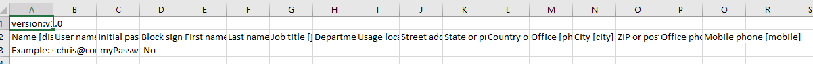

---
lab:
  title: '05: Hinzufügen von Gastbenutzern zum Verzeichnis'
  learning path: '01'
  module: Module 01 - Implement an identity management solution
---

# Lab 05: Hinzufügen von Gastbenutzern zum Verzeichnis

## Labszenario

Ihr Unternehmen arbeitet mit vielen Anbietern zusammen, und gelegentlich müssen Sie Ihrem Verzeichnis einige Lieferantenkonten als Gast hinzufügen.

#### Geschätzte Dauer: 20 Minuten

### Übung 1: Hinzufügen von Gastbenutzern zum Verzeichnis

#### Aufgabe: Hinzufügen des Gastbenutzers

1. Melden Sie sich bei [https://entra.Microsoft.com](https://entra.microsoft.com) als Benutzerin bzw. Benutzer an, der/dem eine eingeschränkte Administrator-Verzeichnisrolle oder die Rolle „Gasteinladender“ zugewiesen ist, oder als globaler Administrator.

2. Wählen Sie **Identität**.

3. Wählen Sie unter **Benutzer** die Option  **Alle Benutzer** aus.

4. Wählen Sie  **+ Neuer Benutzer** aus.

5. Wählen Sie im Menü „Neuer Benutzer“ die Option **Invite external user** aus, und fügen Sie dann die Informationen des Gastbenutzers hinzu.

    **HINWEIS**: Gruppen-E-Mail-Adressen werden nicht unterstützt. Geben Sie die E-Mail-Adresse einer Einzelperson ein. Einige E-Mail-Anbieter erlauben Benutzern auch, ihren E-Mail-Adressen ein Pluszeichen (+) und zusätzlichen Text hinzuzufügen. Dies kann beispielsweise beim Filtern im Posteingang nützlich sein. Allerdings unterstützt Microsoft Entra ID derzeit keine Pluszeichen in E-Mail-Adressen. Um Probleme bei der Übermittlung zu vermeiden, lassen Sie das Pluszeichen und alle nachfolgenden Zeichen bis zum @-Symbol weg.

6. Geben Sie eine E-Mail-Adresse, wie **sc300externaluser1@sc300email.com** ein.

7. Klicken Sie auf die Registerkarte **Eigenschaften**.

8. Vergewissern Sie sich, dass auf der Seite „Benutzer“ Ihr Konto aufgeführt ist und dass in der Spalte **Benutzertyp** der Eintrag **Gast** angezeigt wird.

9. Wählen Sie dann **Überprüfen + einladen** und dann **Einladen** aus.


Nach dem Senden der Einladung wird das Benutzerkonto dem Verzeichnis automatisch als Gast hinzugefügt.


### Übung 2: Einladen von Gastbenutzern per Massenvorgang

#### Aufgabe 1: Massenbenutzereinladung

Vor kurzem wurde eine Partnerschaft mit einem anderen Unternehmen geschlossen. Vorerst werden Mitarbeiter des Partnerunternehmens als Gäste hinzugefügt. Sie müssen sicherstellen, dass Sie mehrere Gastbenutzer gleichzeitig importieren können.

1. Melden Sie sich bei [https://entra.microsoft.com](https://entra.microsoft.com) als globaler Administrator an.

2. Wählen Sie im Navigationsbereich **Identität** aus.

3. Wählen Sie unter **Benutzer** die Option **Alle Benutzer** aus.

4. Wählen Sie auf der Seite „Benutzer“ im Menü **Massenvorgänge > Masseneinladung** aus.

     

5. Wählen Sie im Bereich „Massenbenutzereinladung“ die Option **Herunterladen**, um den Download mit Einladungseigenschaften in eine CSV-Beispieldatei durchzuführen.

6. Sehen Sie sich die CSV-Datei in einem Editor an, um die Vorlage zu überprüfen.

7. Öffnen Sie die CSV-Vorlage, und fügen Sie eine Zeile für jeden Gastbenutzer hinzu. Erforderliche Werte:

    - **E-Mail-Adresse für Einladung**: Der Benutzer, der eine Einladung erhält
    - **Umleitungs-URL**: Die URL, an die der eingeladene Benutzer nach dem Akzeptieren der Einladung weitergeleitet wird.

    

8. Speichern Sie die Datei.

9. Navigieren Sie auf der Seite „Massenbenutzereinladung“ unter **CSV-Datei hochladen** zur entsprechenden Datei.

     **Hinweis**: Wenn Sie die Datei auswählen, wird mit der Überprüfung der CSV-Datei begonnen.

10. Nach der Überprüfung des Dateiinhalts wird die Meldung **Datei erfolgreich hochgeladen** angezeigt. Wenn Fehler vorliegen, müssen Sie diese beheben, bevor Sie den Auftrag übermitteln können.

    

11. Wenn Ihre Datei die Überprüfung bestanden hat, wählen Sie **Senden** aus, um den Azure-Massenvorgang zum Hinzufügen der Einladungen zu starten.

12. Wählen Sie zum Anzeigen des Auftragsstatus **Klicken Sie hier, um den Status für jeden Vorgang anzuzeigen** aus. Alternativ können Sie im Abschnitt Aktivität die Option **Ergebnisse von Massenvorgängen** auswählen. Wenn Sie ausführliche Informationen zu jedem Zeilenelement des Massenvorgangs erhalten möchten, markieren Sie die Werte unter der Spalte **# Erfolg**, **# Fehler** oder **Anforderungen insgesamt**. Wenn Fehler aufgetreten sind, werden die Fehlerursachen aufgeführt.

    

13. Nach Abschluss des Vorgangs wird eine Benachrichtigung angezeigt, dass der Massenvorgang erfolgreich abgeschlossen wurde.

#### Aufgabe 2: Einladen von Gastbenutzern mit PowerShell

1. Öffnen Sie PowerShell als Administrator. Dazu können Sie in Windows nach PowerShell suchen und „Als Administrator ausführen“ auswählen. 

**Hinweis**: Sie müssen PowerShell Version 7.2 oder höher verwenden, damit dieses Lab funktioniert.  Wenn PowerShell geöffnet wird, wird oben auf dem Bildschirm die Version angezeigt. Wenn Sie eine ältere Version verwenden, befolgen Sie die angezeigten Anweisungen, um zu https://aka.ms/PowerShell-Release?tag=7.3.9 zu wechseln. Scrollen Sie nach unten zum Abschnitt „Assets“, und wählen Sie „powershell-7.3.1-win-x64.msi“ aus. Wenn der Download abgeschlossen ist, wählen Sie „Datei öffnen“ aus. Installieren Sie unter Verwendung aller Standardwerte.

2. Sie müssen das Microsoft.Graph PowerShell-Modul installieren, wenn Sie es noch nicht verwendet haben.  Führen Sie die folgenden beiden Befehle aus, und drücken Sie „Y“, wenn Sie aufgefordert werden zu bestätigen:

    ```
    Install-Module Microsoft.Graph
    ```
3. Vergewissern Sie sich, dass das Microsoft.Graph-Modul installiert ist:

    ```
    Get-InstalledModule Microsoft.Graph
    ```
    

4. Als Nächstes müssen Sie sich bei Azure anmelden, indem Sie Folgendes ausführen:  

    ```
    Connect-MgGraph -Scopes "User.ReadWrite.All"
    ``` 
    Der Edge-Browser wird geöffnet, und Sie werden aufgefordert, sich anzumelden.  Verwenden Sie das MOD-Administratorkonto, um eine Verbindung herzustellen.  Akzeptieren Sie die Berechtigungsanforderung; schließen Sie dann das Browserfenster.

5. Legen Sie die Werte für die E-Mail fest und leiten Sie sie für den externen Benutzer um:

    ```
    Import-Module Microsoft.Graph.Identity.SignIns
    
    $params = @{
        invitedUserEmailAddress = "admin@fabrikam.com"
        inviteRedirectUrl = "https://myapp.contoso.com"
    }
    ```

6. Senden Sie den Befehl „MgInvitation“, um den externen Benutzer einzuladen:

    ```
    New-MgInvitation -BodyParameter $params
    ```

7. Sie können PowerShell zu diesem Zeitpunkt schließen.
    
Sie wissen jetzt, wie Sie Benutzende im Microsoft Entra Admin Center, Microsoft 365 Admin Center und über Masseneinladungen mit einer csv-Datei einladen können und wie Sie Benutzende mit PowerShell-Befehlen einladen können.  Sie können das Microsoft Entra Admin Center aufrufen und alle Benutzenden überprüfen, um zu sehen, dass ADMIN als externer Benutzer hinzugefügt wurde.
