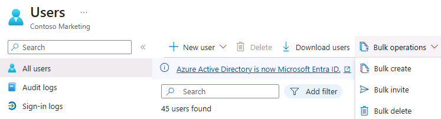
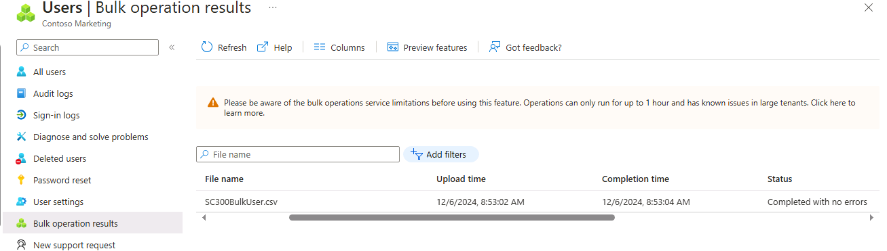

---
lab:
  title: Hinzufügen von Gastbenutzern zum Verzeichnis
  learning path: '01'
  module: Module 01 - Implement an identity management solution
---

# Lab: Hinzufügen von Gastbenutzern zum Verzeichnis

## Labszenario

Ihr Unternehmen arbeitet mit vielen Anbietern zusammen, und gelegentlich müssen Sie Ihrem Verzeichnis als Gast einige Lieferantenkonten hinzufügen.

#### Geschätzte Dauer: 20 Minuten

### Übung: Hinzufügen von Gastbenutzers zum Verzeichnis

#### Aufgabe – Hinzufügen des Gastbenutzers

1. Melden Sie sich beim Azure-Portal als Benutzer an, dem eine eingeschränkte Azure AD-Administratorrolle oder die Rolle „Gasteinladender“ zugewiesen ist.

2. Wählen Sie "Identität" ** aus**.

3. Wählen Sie unter **"Benutzer**" "Alle Benutzer" aus **.**

4. Wählen Sie  **Neuer Benutzer** aus.

5. Wählen Sie auf der Seite „Neuer Benutzer“ die Option **Benutzer einladen** aus, und fügen Sie dann die Informationen des Gastbenutzers hinzu.

    Gruppen-E-Mail-Adressen werden nicht unterstützt. Geben Sie die E-Mail-Adresse einer Einzelperson ein. Einige E-Mail-Anbieter erlauben Benutzern auch, ihren E-Mail-Adressen ein Pluszeichen (+) und zusätzlichen Text hinzuzufügen. Dies kann beispielsweise beim Filtern im Posteingang nützlich sein. Allerdings unterstützt Microsoft Entra ID derzeit keine Pluszeichen in E-Mail-Adressen. Um Probleme bei der Übermittlung zu vermeiden, lassen Sie das Pluszeichen und alle nachfolgenden Zeichen bis zum @-Symbol weg.

6. Geben Sie eine E-Mail-Adresse ein.

7. Klicken Sie auf die Registerkarte **Eigenschaften**.

8. Vergewissern Sie sich, dass auf dem Bildschirm „Benutzer“ Ihr Konto aufgeführt ist und dass in der Spalte **Benutzertyp****Gast** angezeigt wird.

9. Wählen Sie **Überprüfen + einladen** und dann **Einladen** aus.


Nach dem Senden der Einladung wird das Benutzerkonto dem Verzeichnis automatisch als Gast hinzugefügt.


### Übung: Einladen von Gastbenutzern per Massenvorgang

#### Aufgabe 1 – Massenbenutzereinladung

Eine kürzliche Partnerschaft wurde mit einem anderen Unternehmen gegründet. Derzeit werden Mitarbeiter des Partnerunternehmens als Gäste hinzugefügt. Sie müssen sicherstellen, dass Sie mehrere Gastbenutzer gleichzeitig importieren können.

1. Melden Sie sich bei Ihrem Mandanten als globaler Administrator an.

2. Wählen Sie im Navigationsbereich **Identität** aus.

3. Wählen Sie unter **Benutzer** **Alle Benutzer**aus.

4. Wählen Sie auf dem Blatt „Benutzer“ im Menü **Massenvorgänge > Masseneinladung** aus.

     

5. Wählen Sie im Bereich „Massenbenutzereinladung“ die Option **Herunterladen**, um den Download mit Einladungseigenschaften in eine CSV-Beispieldatei durchzuführen.

6. Sehen Sie sich die CSV-Datei in einem Editor an, um die Vorlage zu überprüfen.

7. Öffnen Sie die CSV-Vorlage, und fügen Sie eine Zeile für jeden Gastbenutzer hinzu. Erforderliche Werte:

    - **E-Mail-Adresse für Einladung**: Der Benutzer, der eine Einladung erhält
    - **Umleitungs-URL**: Die URL, an die der eingeladene Benutzer nach dem Akzeptieren der Einladung weitergeleitet wird.

    

8. Speichern Sie die Datei .

9. Navigieren Sie auf der Seite Massenbenutzereinladung unter **CSV-Datei hochladen** zur entsprechenden Datei.

     Wenn Sie die Datei auswählen, wird mit der Überprüfung der CSV-Datei begonnen.

10. Nach der Überprüfung des Dateiinhalts wird die Meldung **Datei erfolgreich hochgeladen** angezeigt. Wenn Fehler vorliegen, müssen Sie diese beheben, bevor Sie den Auftrag übermitteln können.

    

11. Wenn Ihre Datei die Überprüfung bestanden hat, wählen Sie **Senden** aus, um den Azure-Massenvorgang zum Hinzufügen der Einladungen zu starten.

12. Wählen Sie zum Anzeigen des Auftragsstatus **Klicken Sie hier, um den Status für jeden Vorgang anzuzeigen.** aus. Alternativ können Sie im Abschnitt Aktivität die Option **Ergebnisse von Massenvorgängen** auswählen. Wenn Sie ausführliche Informationen zu jedem Zeilenelement des Massenvorgangs erhalten möchten, wählen Sie die Werte unter der Spalte **# Erfolg**, **# Fehler** oder **Anforderungen insgesamt** aus. Wenn Fehler aufgetreten sind, werden die Fehlerursachen aufgeführt.

    

13. Nach Abschluss des Vorgangs wird eine Benachrichtigung angezeigt, dass der Massenvorgang erfolgreich abgeschlossen wurde.

#### Masseneinladung von B2B-Gastbenutzern mit PowerShell

1. Starten Sie PowerShell als Administrator.Dazu können Sie in Windows nach PowerShell suchen und "Als Administrator ausführen" auswählen. 

**Hinweis** : Sie müssen powerShell Version 7.2 oder höher verwenden, damit diese Übung funktioniert.  Wenn PowerShell geöffnet wird, erhalten Sie oben auf dem Bildschirm eine Version, wenn Sie ausgeführt werden und eine ältere Version ausgeführt wird, befolgen Sie die Anweisungen auf dem Bildschirm, um zu https://aka.ms/PowerShell-Release?tag=7.3.9wechseln. Scrollen Sie nach unten zum Abschnitt "Assets", und wählen Sie powershell-7.3.1-win-x64.msi aus. Wenn der Download abgeschlossen ist, wählen Sie "Datei öffnen" aus. Installieren Sie alle Standardwerte.

2. Sie müssen das Microsoft.Graph PowerShell-Modul installieren, wenn Sie es noch nicht verwendet haben.  Führen Sie den folgenden Befehl aus, und bestätigen Sie den Vorgang, wenn Sie dazu aufgefordert werden:

    ```
    Install-Module Microsoft.Graph
    ```
3. Vergewissern Sie sich, dass das Microsoft.Graph-Modul installiert ist:

    ```
    Get-InstalledModule Microsoft.Graph
    ```
    

4. Als Nächstes müssen Sie sich bei Azure anmelden, indem Sie Folgendes ausführen:  

    ```
    Connect-MgGraph -Scopes "User.ReadWrite.All"
    ``` 
    Der Edge-Browser wird geöffnet, und Sie werden aufgefordert, sich anzumelden.  Verwenden Sie das MOD-Administratorkonto, um eine Verbindung herzustellen.  Zugriffsanforderung; schließen Sie dann das Browserfenster.

5. Legen Sie die Werte für die E-Mail fest und leiten Sie sie für den externen Benutzer um:

    ```
    Import-Module Microsoft.Graph.Identity.SignIns
    
    $params = @{
        invitedUserEmailAddress = "admin@fabrikam.com"
        inviteRedirectUrl = "https://myapp.contoso.com"
    }
    ```

6. Der Befehl "MgInvitation" wurde gesendet, um den externen Benutzer einzuladen:

    ```
    New-MgInvitation -BodyParameter $params
    ```

7. Sie können PowerShell zu diesem Zeitpunkt schließen.
    
Sie wissen jetzt, wie Sie Benutzer im Microsoft Entra Admin Center, Microsoft 365 Admin Center, Masseneinladungen mit einer CSV-Datei einladen und Benutzer mit PowerShell-Befehlen einladen.  Sie können das Microsoft Entra Admin Center aufrufen und alle Benutzer überprüfen, um zu sehen, dass ADMIN als externer Suer hinzugefügt wurde.
