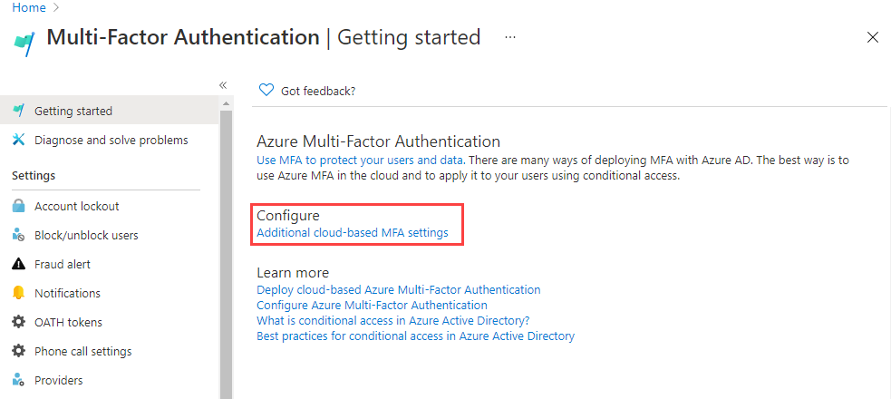

---
lab:
  title: Aktivieren der Multi-Faktor-Authentifizierung
  learning path: '02'
  module: Module 02 - Implement an Authentication and Access Management Solution
---

# Aktivieren der Multi-Faktor-Authentifizierung

## Labszenario

Um die Sicherheit in Ihrer Organisation zu verbessern, wurden Sie angewiesen, die mehrstufige Authentifizierung für Microsoft Entra ID zu aktivieren.

#### Geschätzte Dauer: 15 Minuten

**WICHTIG :** Für diese Übung ist eine Microsoft Entra ID Premium-Lizenz erforderlich.

### Übung 1 – Überprüfen und Aktivieren der mehrstufigen Authentifizierung in Azure

#### Aufgabe 1 – Überprüfen der Azure Multi-Factor Authentication-Optionen

1. Navigieren Sie zum Azure-Portal, und melden Sie sich mit dem Konto eines globalen Administrators für das Verzeichnis an.

2. Verwenden Sie die Suchfunktion, und suchen Sie nach **mehrstufigen Suchfunktionen**.

3. Wählen Sie im Fenster **Multi-Faktor-Authentifizierung** einen Benutzer aus.

    Alternativ können Sie "Identität"** öffnen **und dann "Schutz **" und **"Mehrstufige Authentifizierung **" auswählen**.

4. Klicken Sie unter **Konfigurieren** auf den Link **Zusätzliche cloudbasierte MFA-Einstellungen**.

    

5. Auf der neuen Browserseite werden die MFA-Optionen für Azure-Benutzer und -Diensteinstellungen angezeigt.

    

    Hier wählen Sie normalerweise die unterstützten Authentifizierungsmethoden aus. Im obigen Screenshot sind alle ausgewählt.

    Hier können Sie auch App-Kennwörter aktivieren oder deaktivieren, damit Benutzer eindeutige Kennwörter für Konten erstellen können, falls eine App die mehrstufige Authentifizierung nicht unterstützt. Dieses Feature ermöglicht es dem Benutzer, sich mit seiner Microsoft Entra-Identität mit einem anderen Kennwort zu authentifizieren, das für diese App spezifisch ist.

#### Aufgabe 2 – Einrichten von Regeln für bedingten Zugriff für MFA für Delia Dennis

Als Nächstes wird erläutert, wie Sie Regeln für den bedingten Zugriff einrichten, die die MFA für Gastbenutzer erzwingen, die auf bestimmte Apps in Ihrem Netzwerk zugreifen.

1. Navigieren Sie im Microsoft Entra Admin Center zu Identität, zu Schutz und dann zu Bedingter Zugriff.

2. Wählen Sie im oberen Menü die Option **Neue Richtlinie** aus. Wählen Sie im Dropdownmenü die Option **Neues Modell erstellen** aus.

    

3. Benennen Sie Ihre Richtlinie, z. B **. MFA_for_Delia**.

4. Wählen Sie unter „Zuweisungen“ die Option **Benutzer- oder Workloadidentitäten** aus.

    - 0 Benutzer- oder Workloadidentitäten ausgewählt  
    - Aktivieren Sie auf dem rechten Bildschirm das Kontrollkästchen "Benutzer und Gruppen** auswählen**", um sie zu konfigurieren.
    - Benutzer und Gruppen** überprüfen **(verfügbare Benutzer werden rechts aufgefüllt)
    - Wählen Sie **"Delia Dennis**" aus der Liste der Benutzer und dann die Schaltfläche "Auswählen **" aus**.

5. Wählen Sie unter Zielressourcen die Option **Keine Zielressourcen ausgewählt** aus.

   - Stellen Sie im Dropdownmenü sicher, dass **Cloud-Apps** ausgewählt sind.
   - Markieren Sie **unter "Einschließen" alle Cloud-Apps** , und notieren Sie sich die Warnung, dass sie möglicherweise gesperrt werden. 
   - Ändern Sie nun unter "Einschließen" Ihre Auswahl in "Apps auswählen".Now under Include, change your choice to **Select apps** item.
   - Wählen Sie **im neu geöffneten Dialogfeld Office 365** aus.
      - **Erinnerung** – in einer vorherigen Übung haben wir Delia Dennis eine Office 365-Lizenz gegeben und angemeldet, um sicherzustellen, dass es funktioniert hat.
   - Klicken Sie auf **Auswählen**.

6. Überprüfen Sie den Abschnitt Bedingungen.

   - Klicken Sie auf **Speicherorte**, und konfigurieren Sie diese Option auf **Alle Speicherorte**.

7. Wählen Sie unter **Zugriffssteuerungen** und **Erteilen** die Option **0 Steuerelemente ausgewählt** aus.

8. Aktivieren Sie das **Kontrollkästchen "Mehrstufige Authentifizierung** erforderlich", um MFA zu erzwingen.

9. Stellen Sie sicher, dass **Alle ausgewählten Steuerungen anfordern** ausgewählt ist.

10. Wählen Sie **Auswählen**.

11. Legen Sie **Richtlinie aktivieren** auf **Ein** fest.

12. Klicken Sie auf **Erstellen**, um die Richtlinie zu erstellen.

    

    Die MFA ist jetzt für die ausgewählten Anwendungen aktiviert. Wenn ein Gast das nächste Mal versucht, sich bei dieser App anzumelden, wird dieser aufgefordert, sich für die MFA zu registrieren.

#### Aufgabe 3 – Anmeldeinformationen von Delia testen

1. Öffnen Sie ein neues InPrivate-Browserfenster.
2. Stellen Sie eine Verbindung mit https://www.office.comher.
3. Wählen Sie die Schaltfläche Anmelden aus.
4. Geben Sie **DeliaD@** `<<your domain address>>`ein.
5. Geben Sie das Kennwort ein = Geben Sie das globale Administratorkennwort des Mandanten ein (Hinweis: Verweisen Sie auf die Registerkarte "Laborressourcen", um das Administratorkennwort abzurufen).

An diesem Punkt geschieht eins von zwei Dingen:  Sie sollten eine Meldung erhalten, dass Sie die Authenticator-App einrichten und sich für MFA registrieren müssen.  Folgen Sie den Anweisungen, um mit Ihrem persönlichen Telefon fertig zu werden.  HINWEIS : Es besteht die Möglichkeit, dass Sie möglicherweise eine Anmeldefehlermeldung mit mehreren Optionen zum Fortfahren erhalten.  Wählen Sie in diesem Fall die **Option "Erneut** versuchen" aus.

Sie können sehen, dass aufgrund der Regel für bedingten Zugriff, die wir für Delia erstellt haben, MFA erforderlich ist, um die Office 365-Startseite zu starten.

### Übung 2 – Konfigurieren der MFA für die Anmeldung

#### Aufgabe 1 : Konfigurieren von Microsoft Entra per User MFA

Abschließend wird erläutert, wie Sie die MFA für Benutzerkonten konfigurieren können. Nun folgt eine weitere Möglichkeit, zu den Einstellungen für die mehrstufige Authentifizierung zu gelangen.

1. Wechseln Sie zurück zum Microsoft Entra Admin Center, und suchen Sie das Navigationsmenü "Einzug links".

2. Wählen Sie **Benutzer** und dann **Alle Benutzer** aus.

3. Wählen Sie im oberen Menü des Bereichs Benutzer die Option MFA pro Benutzer aus.

   

4. Eine neue Browserregisterkarte/ein neues Browserfenster wird mit einem Mehrstufigen Authentifizierungs-Benutzereinstellungen-Dialogfeld geöffnet.

   Sie können die MFA auf Benutzerbasis aktivieren oder deaktivieren, indem Sie einen Benutzer auswählen und dann die Kurzanleitung auf der rechten Seite befolgen.

   

5. Wählen Sie **Adele Vance** mit einem Häkchen aus.
6. Wählen Sie die **Option "Aktivieren"** unter den schnellen Schritten aus.
7. Lesen Sie das Popup "Benachrichtigung", wenn Sie es erhalten, und wählen Sie **dann die Schaltfläche "Mehrstufige Authentifizierung** aktivieren" aus.
8. Wählen Sie **Schließen** aus.
9. Beachten Sie, dass Adele jetzt als MFA-Status aktiviert** ist**.
10. Sie können Diensteinstellungen** auswählen**, um den Bildschirm für die MFA-Einstellung anzuzeigen, der weiter oben in der Übung zu sehen ist.
11. Schließen Sie die Registerkarte Einstellungen.

#### Aufgabe 2 – Versuchen Sie, sich als Adele anzumelden

1. Wenn Sie ein weiteres Beispiel für den MFA-Anmeldevorgang sehen möchten, können Sie versuchen, sich bei einem Adele anzumelden.
