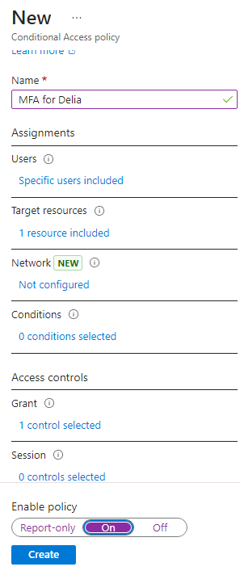

---
lab:
  title: 08 - Aktivieren der Multi-Faktor-Authentifizierung
  learning path: '02'
  module: Module 02 - Implement an Authentication and Access Management Solution
---

# Lab 08 - Aktivieren der Multi-Faktor-Authentifizierung

### Anmeldetyp = Microsoft 365- + E5-Mandantenanmeldung

## Labszenario

Um die Sicherheit in Ihrer Organisation zu verbessern, wurden Sie angewiesen, die Multi-Faktor-Authentifizierung für Microsoft Entra ID zu aktivieren.

#### Geschätzte Dauer: 15 Minuten

**WICHTIG** - Für diese Übung ist eine Microsoft Entra ID Premium Lizenz erforderlich.

### Übung 1: Überprüfen und Aktivieren der Multi-Faktor-Authentifizierung in Azure

#### Aufgabe 1: Überprüfen der Optionen der Multi-Faktor-Authentifizierung von Azure

1. Navigieren Sie zu [https://entra.microsoft.com](https://entra.microsoft.com), und melden Sie sich mit dem Konto eines globalen Administrators für das Verzeichnis an.

2. Verwenden Sie die Suchfunktion und suchen Sie nach **Multifaktor**.

3. Wählen Sie in den Suchergebnissen **Multi-Faktor-Authentifizierung** aus.

    Alternativ können Sie **Identität** öffnen, dann **Schutz** wählen und **Multi-Faktor-Authentifizierung** auswählen.

4. Wählen Sie auf der Seite „Erste Schritte“ unter **Konfigurieren** den Link **Zusätzliche cloudbasierte MFA-Einstellungen** aus.

    

5. Auf der neuen Browserseite werden die MFA-Optionen für Azure-Benutzer- und -Diensteinstellungen angezeigt.

    

    Hier wählen Sie normalerweise die unterstützten Authentifizierungsmethoden aus. Im obigen Screenshot sind alle ausgewählt.

    Hier können Sie auch App-Kennwörter aktivieren oder deaktivieren, damit Benutzer eindeutige Kennwörter für Konten erstellen können, falls eine App die mehrstufige Authentifizierung nicht unterstützt. Dieses Feature ermöglicht es dem Benutzenden, sich mit seiner Microsoft Entra-Identität mit einem anderen Kennwort zu authentifizieren, das für diese App spezifisch ist.

#### Aufgabe 2: Einrichten von Regeln für bedingten Zugriff für MFA für Delia Dennis

Als Nächstes wird erläutert, wie Sie Regeln für den bedingten Zugriff einrichten, die die MFA für Gastbenutzer erzwingen, die auf bestimmte Apps in Ihrem Netzwerk zugreifen.

1. Wechseln Sie zurück zum Microsoft Entra Admin Center und wählen Sie **Identität**, dann **Schutz** und dann **Bedingter Zugriff**.

2. Wählen Sie im Menü **+ Neue Richtlinie** aus. Wählen Sie aus der Dropdown-Liste **+ Neue Richtlinie erstellen**.

    

3. Benennen Sie Ihre Richtlinie, beispielsweise **MFA_for_Delia**.

4. Wählen Sie unter „Zuweisungen“ die Option **Benutzer- oder Workloadidentitäten** aus.

    - Wählen Sie **0 Benutzer- oder Workloadidentitäten ausgewählt** aus.  
    - Aktivieren Sie auf dem rechten Bildschirmseite das Kontrollkästchen **Benutzer und Gruppen auswählen**, um sie zu konfigurieren.
    - Aktivieren Sie **Benutzer und Gruppen** (verfügbare Benutzer werden rechts aufgefüllt).
    - Wählen Sie **Delia Dennis** in der Liste der Benutzer und dann die Schaltfläche **Auswählen** aus.

5. Wählen Sie **Keine Zielressourcen ausgewählt** in Zielressourcen.

   - Wählen Sie im Dropdown **Cloud-Apps** aus.
   - Markieren Sie unter „Einschließen“ die Option **Ressourcen (ehemals Cloud-Anwendungen)** und beachten Sie die Warnung, die angezeigt wird, dass Sie sich möglicherweise selbst aussperren. 
   - Wählen Sie nun im Abschnitt „Einschließen“ den Punkt **Ressourcen auswählen** aus.
   - Wählen Sie im Abschnitt **Auswahl** den Link **Keine**.
   - Wählen Sie im neu geöffneten Dialogfeld **Office 365** aus.
      - **Erinnerung**: In einem vorherigen Lab haben wir Delia Dennis eine Office 365-Lizenz gegeben und sie angemeldet, um sicherzustellen, dass es funktioniert hat.
   - Wählen Sie **Auswählen** aus.

6. Wählen Sie im Abschnitt „Bedingungen“ einen Netzwerkstandort und wählen Sie dann **Nicht konfiguriert**.

   - Im Abschnitt **Bedingungen** wählen Sie den Link **0 Bedingungen ausgewählt**.
   - Unten im neu geöffneten Menü finden Sie den Abschnitt **Standorte**, und wählen Sie **Nicht konfiguriert**.
   - Wählen Sie **Ja** für den Punkt **Konfigurieren**.
   - Wählen Sie **ein beliebiges Netzwerk oder einen beliebigen Standort** aus.

7. Suchen Sie unter **Zugriffssteuerungen** den Abschnitt **Zuweisung** und wählen Sie den Link **0 ausgewählte Steuerungen**.

   - Aktivieren Sie das Kontrollkästchen **Multi-Faktor-Authentifizierung anfordern**, um MFA zu erzwingen.
   - Stellen Sie sicher, dass **Require all the slected controls** aktiviert ist.
   - Wählen Sie **Auswählen**.

8. Legen Sie **Richtlinie aktivieren** auf **Ein** fest.

9. Wählen Sie die Schaltfläche **Erstellen** aus, um die Richtlinie zu erstellen.

    

    Die MFA ist jetzt für die ausgewählten Benutzer und Anwendungen aktiviert. Wenn ein Gast das nächste Mal versucht, sich bei dieser App anzumelden, wird dieser aufgefordert, sich für die MFA zu registrieren.

#### Aufgabe 3: Testen der Anmeldeinformationen von Delia

1. Öffnen Sie ein neues InPrivate-Browserfenster.
2. Stellen Sie eine Verbindung mit https://www.office.com her.
3. Wählen Sie die Anmelde-Option aus.
4. Geben Sie **DeliaD@** `<<your domain address>>` ein.
5. Geben Sie das Kennwort ein = Geben Sie das globale Administratorkennwort des Mandanten ein (Hinweis: Sie finden das Administratorkennwort auf der Registerkarte „Labressourcen“).

**Hinweis**: An diesem Punkt geschieht eine der beiden folgenden Aktionen:  Sie sollten eine Meldung erhalten, dass Sie die Authenticator-App einrichten und sich für MFA registrieren müssen.  Befolgen Sie die Aufforderungen, um den Vorgang über Ihr persönliches Telefon abzuschließen.  HINWEIS: Es kann sein, dass Sie eine Anmeldefehlermeldung mit mehreren Optionen zum Fortfahren erhalten.  Wählen Sie in diesem Fall **Erneut versuchen** aus.

Sie können sehen, dass aufgrund der Regel für bedingten Zugriff, die wir für Delia erstellt haben, MFA erforderlich ist, um die Office 365-Startseite zu öffnen.

### Übung 2: Konfigurieren der MFA so, dass sie für die Anmeldung erforderlich ist

#### Aufgabe 1 - Microsoft Entra pro Benutzender MFA konfigurieren

Abschließend wird erläutert, wie Sie die MFA für Benutzerkonten konfigurieren können. Nun folgt eine weitere Möglichkeit, zu den Einstellungen für die mehrstufige Authentifizierung zu gelangen.

1. Wechseln Sie zurück zum Microsoft Entra Admin Center und suchen Sie das linke Navigationsmenü von Indentität.

2. Wählen Sie **Benutzende**, dann wählen Sie **Alle Benutzenden**.

3. Wählen Sie im oberen Menü des Bereichs „Benutzer“ **MFA pro Benutzer** aus.
  - HINWEIS: Möglicherweise müssen Sie die Elipse (…) verwenden, um zum Menüelement „Benutzerbasierte MFA“ zu gelangen.

   

4. Eine neue Browserregisterkarte/Ein neues Browserfenster wird mit einem Dialogfeld für Benutzereinstellungen für die Multi-Faktor-Authentifizierung geöffnet.

   Sie können die MFA auf Benutzerbasis aktivieren oder deaktivieren, indem Sie einen Benutzer auswählen und dann die Kurzanleitung auf der rechten Seite befolgen.

   

5. Aktivieren Sie den Eintrag **Adele Vance**.
6. Wählen Sie die Option **MFA aktivieren** unter „QuickSteps“.
7. Lesen Sie das Popup „Benachrichtigung“, falls es angezeigt wird, und wählen Sie dann die Schaltfläche **Multi-Factor Auth aktivieren** aus.
8. Wählen Sie **Schließen** aus.
9. Beachten Sie, dass für Adele jetzt der MFA-Status **Aktiviert** lautet.
10. Sie können **Diensteinstellungen** auswählen, um den Bildschirm für die MFA-Einstellung anzuzeigen, der weiter oben in der Übung gezeigt wird.
11. Schließen Sie die Registerkarte „MFA-“Einstellungen.

#### Aufgabe 2: Versuchen, sich als Adele anzumelden

1. Wenn Sie ein weiteres Beispiel für den MFA-Anmeldeprozess sehen möchten, können Sie versuchen, sich als Adele anzumelden.
