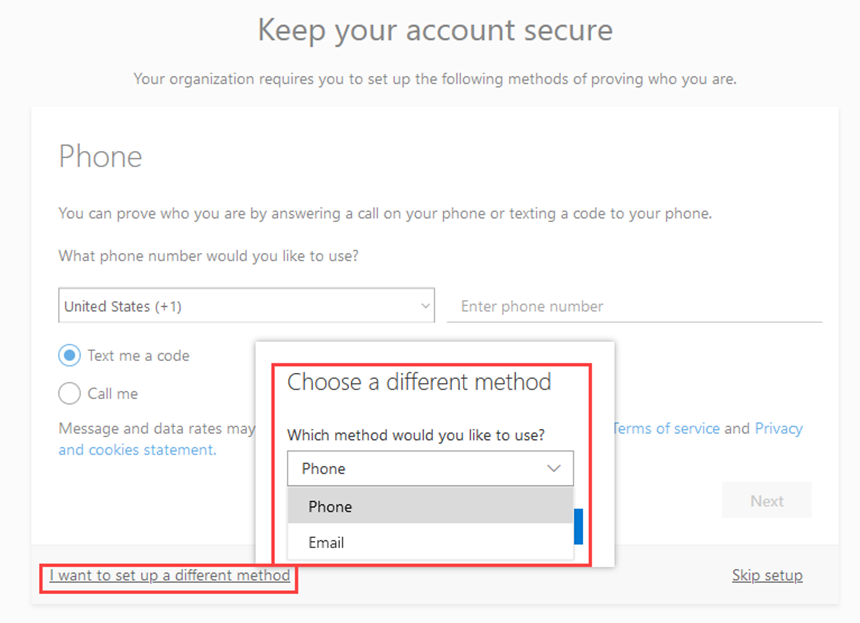
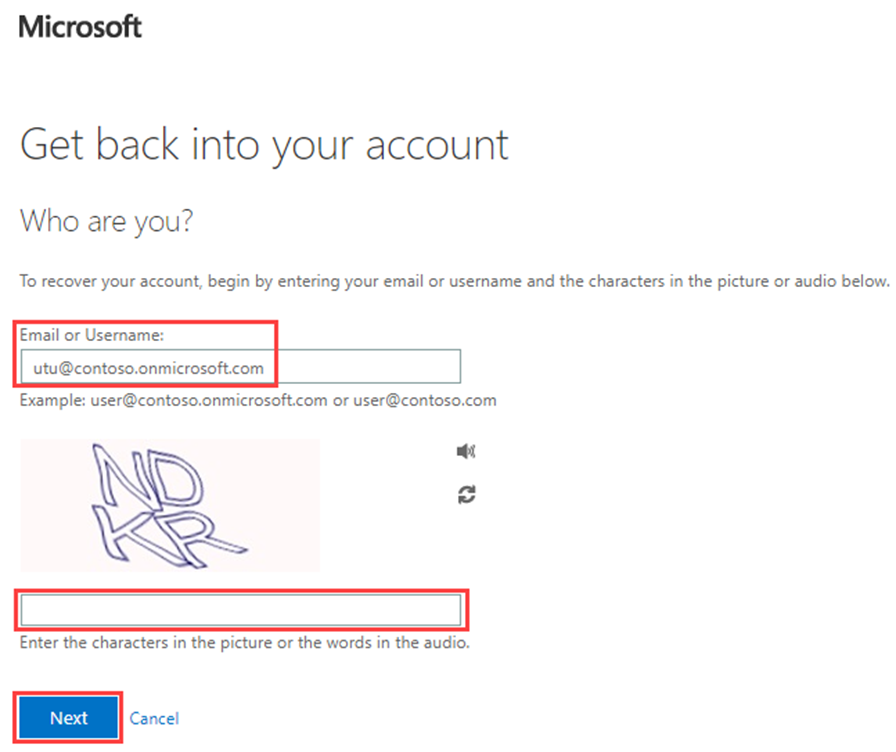

---
lab:
  title: Aktivieren der Self-Service-Kennwortzurücksetzung von Microsoft Entra
  learning path: '02'
  module: Module 02 - Implement an Authentication and Access Management Solution
---

# Lab 3.2: Konfigurieren und Bereitstellen der Self-Service-Kennwortzurücksetzung
## Labszenario

Das Unternehmen hat beschlossen, die Mitarbeiter zu unterstützen und die Self-Service-Kennwortzurücksetzung zu ermöglichen. In diesem Abschnitt konfigurieren Sie Ihre Azure DevOps-Organisation.

#### Geschätzte Dauer: 15 Minuten

### Übung 1 – Erstellen einer Gruppe mit aktiviertem SSPR und Hinzufügen von Benutzern zu dieser Gruppe

#### Aufgabe 1 – Erstellen einer Gruppe zum Zuweisen von SSPR zu

Sie möchten SSPR zunächst für eine begrenzte Gruppe von Benutzern einführen, um sicherzustellen, dass die SSPR-Konfiguration wie erwartet funktioniert. Sie erstellen nun eine Sicherheitsgruppe für die begrenzte Einführung und fügen der Gruppe einen Benutzer hinzu.

1. Öffnen Sie im Microsoft Entra Admin Center das **Navigationsmenü "Identität** " auf der linken Seite.
1. Wählen Sie unter **"Gruppen**" " **Alle Gruppen** " und dann **im rechten Seitenfenster "Neue Gruppe** " aus.

2. Erstellen Sie eine neue Gruppe mit den folgenden Informationen:

    | **Einstellung**| **Wert**|
    | :--- | :--- |
    | Gruppentyp| Sicherheit|
    | Gruppenname| SSPRTesters|
    | Gruppenbeschreibung| Tester für SSPR-Rollout|
    | Mitgliedschaftstyp| Zugewiesen|
    | Member| Alex Wilber |
    | |  Allan Deyoung |
    | | Bianca Pisani |
  
    
3. Wählen Sie  **Erstellen** aus.

    

#### Aufgabe 2 – Aktivieren von SSPR für Ihre Testgruppe

Aktivieren Sie SSPR für die Gruppe.

1. Navigieren Sie zurück zum **Navigationsmenü "Identität** ".

2. Wählen Sie unter **"Schutz**" die Option **"Kennwortzurücksetzung" aus**.

3. Wählen Sie auf der Seite Eigenschaften der Kennwortzurücksetzung unter Self-Service-Kennwortzurücksetzung aktiviert die Option Ausgewählt aus.

4. Wählen Sie **"Gruppe** auswählen" und dann "SSPRSecurityGroupUser"** aus**.

5. Wählen Sie im Bereich „Richtlinie für die Zurücksetzung des Standardkennworts“ die Gruppe **SSPRTesters**  aus.

6. Wählen Sie auf der Seite Eigenschaften der Kennwortzurücksetzung die Option Speichern aus.

    

7. Suchen Sie auf dem **Bildschirm "Kennwortzurücksetzung**" unter **"Verwalten*", wählen Sie die Standardwerte für jede der **Authentifizierungsmethoden **, ** Registrierung**, **Benachrichtigungen** und Anpassungseinstellungen** aus, und **überprüfen Sie sie.

    **Beachten Sie,** dass das **Telefon** als eine der Authentifizierungsmethoden für den Rest dieser Übung ausgewählt werden muss, sie können aber auch andere Optionen haben.

#### Taks 3 - Registrieren für SSPR mit Alex

Nachdem die SSPR-Konfiguration erstellt wurde, registrieren Sie eine Mobiltelefonnummer für den erstellten Benutzer.

1. Öffnen Sie einen anderen Browser, oder öffnen Sie eine InPrivate-oder Inkognito-Browsersitzung, und navigieren Sie dann zu [https://aka.ms/ssprsetup](https://aka.ms/ssprsetup).

    Dadurch wird sichergestellt, dass Sie zur Benutzerauthentifizierung aufgefordert werden.

2. Melden Sie sich als **AlexW@** `<<organization-domain-name>>.onmicrosoft.com` mit dem Kennwort an = Geben Sie das Administratorkennwort des Mandanten ein(Verweisen Sie auf die Registerkarte "Lab-Ressourcen", um das Administratorkennwort abzurufen).

    Ersetzen Sie „organization-domain-name“ durch Ihren Domänennamen.

3. Wenn Sie zum Aktualisieren des Kennworts aufgefordert werden, geben Sie ein beliebiges neues Kennwort ein. Denken Sie daran, sich das neue Kennwort zu notieren.

4. Klicken Sie im Dialogfeld **Weitere Informationen erforderlich** auf **Weiter**.

5. Wählen Sie auf der Seite "Sicheres Konto beibehalten" die **Option "Telefon**" aus.

    

    In diesem Beispiel verwenden Sie die Option „Telefon“. Geben Sie die Mobiltelefondetails ein.

6. Geben Sie Ihre persönliche Mobiltelefonnummer in das Feld "Telefonnummer" ein.
7. Wählen Sie  **Code per SMS an mich senden** aus.
8. Wählen Sie **Weiter** aus.

9. Sobald Sie den Code auf Ihrem Mobiltelefon erhalten haben, geben Sie ihn in das Textfeld ein, und klicken Sie auf „Weiter“.

10. Nachdem Ihr Telefon registriert wurde, klicken Sie auf „Weiter“, und wählen Sie dann „Fertig“ aus.

11. Schließen Sie den Browser. Sie müssen den Anmeldevorgang nicht abschließen.

#### Vorgang 4 – Testen von SSPR

Testen Sie nun, ob der Benutzer sein Kennwort zurücksetzen kann.

1. Öffnen Sie einen anderen Browser, oder öffnen Sie eine InPrivate-oder Inkognito-Browsersitzung, und navigieren Sie dann zu  [https://portal.azure.com](https://portal.azure.com).

    Dadurch wird sichergestellt, dass Sie zur Benutzerauthentifizierung aufgefordert werden.

2. Geben Sie im Feld **Name** einen Namen ein, und klicken Sie dann auf `<<organization-domain-name>>.onmicrosoft.com`Weiter.

    Ersetzen Sie „organization-domain-name“ durch Ihren Domänennamen.

3. Wählen Sie auf der Seite „Kennwort eingeben“ die Option **Kennwort vergessen** aus.

4. Vervollständigen Sie auf der Seite „Konto wieder aktivieren“ die angeforderten Informationen, und klicken Sie dann auf **Weiter**.

    

5. Wählen Sie in der Aufgabe Überprüfungsschritt 1 die Option Textnachricht an mein Mobiltelefon senden oder Mein Mobiltelefon anrufen aus, geben Sie Ihre Telefonnummer ein, und wählen Sie Text aus.

    

6. Geben Sie Ihren Überprüfungscode ein, und klicken Sie dann auf **Weiter**.

7. Geben Sie im Schritt „Neues Kennwort auswählen“ das neue Kennwort ein, und bestätigen Sie es.  Kennwort empfehlen = **Pass@w.rd1234**.

8. Wählen Sie abschließend **Fertig stellen** aus.

9. Melden Sie sich als **Mia** mit dem neu erstellten Kennwort an.

10. Geben Sie Ihren Überprüfungscode ein, und überprüfen Sie dann, ob Sie den Anmeldevorgang abschließen können.

11. Wenn Sie fertig sind, schließen Sie den Browser.

#### Aufgabe 5 : Was geschieht, wenn Sie versuchen, einen Benutzer nicht in der Gruppe "SSPRTesters" zu verwenden?

1. Öffnen Sie als Test ein neues InPrivate-Browserfenster, und versuchen Sie, sich beim Azure-Portal als GradyA anzumelden, und wählen Sie die **Option "Kennwort** vergessen" aus.
