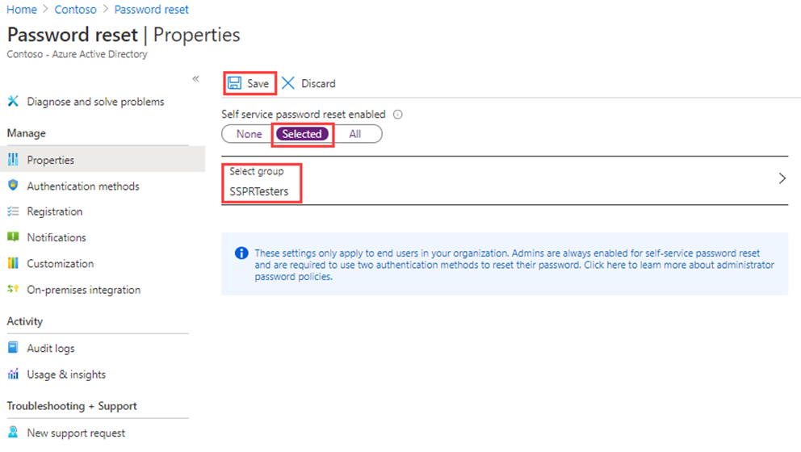

---
lab:
  title: 09 - Microsoft Entra Self-Service-Kennwortzurücksetzung aktivieren
  learning path: '02'
  module: Module 02 - Implement an Authentication and Access Management Solution
---

# Lab 09: Konfigurieren und Bereitstellen der Self-Service-Kennwortzurücksetzung

### Anmeldetyp = Microsoft 365 Admin

## Labszenario

Das Unternehmen hat beschlossen, Mitarbeiter zu unterstützen und die Self-Service-Kennwortzurücksetzung zu ermöglichen. Sie müssen diese Einstellung in Ihrer Organisation konfigurieren.

#### Geschätzte Dauer: 15 Minuten

### Übung 1: Erstellen einer Gruppe mit aktiviertem SSPR und Hinzufügen von Benutzern zu dieser Gruppe

#### Aufgabe 1: Erstellen einer Gruppe, um SSPR zuzuweisen

Sie möchten SSPR zunächst für eine begrenzte Gruppe von Benutzern einführen, um sicherzustellen, dass die SSPR-Konfiguration wie erwartet funktioniert. Sie erstellen nun eine Sicherheitsgruppe für die begrenzte Einführung und fügen der Gruppe einen Benutzer hinzu.

1. Öffnen Sie im Microsoft Entra Admin Center das Navigationsmenü **Identität** auf der linken Seite.
1. Wählen Sie unter **Gruppen** **Alle Gruppen** und wählen Sie **Neue Gruppe** im rechten Fenster.

2. Erstellen Sie eine neue Gruppe mit den folgenden Informationen:

    | **Einstellung**| **Wert**|
    | :--- | :--- |
    | Gruppentyp| Sicherheit|
    | Gruppenname| SSPRTesters|
    | Gruppenbeschreibung| Tester für SSPR-Rollout|
    | Mitgliedschaftstyp| Zugewiesen|
    | Mitglieder| Alex Wilber |
    | |  Allan Deyoung |
    | | Bianca Pisani |
  
    
3. Wählen Sie  **Erstellen** aus.

    

#### Aufgabe 2: Aktivieren von SSPR für Ihre Testgruppe

Aktivieren Sie SSPR für die Gruppe.

1. Browsen Sie zurück zum Navigationsmenü **Identität**.

2. Wählen Sie unter **Schutz** die Option **Kennwortzurücksetzung**.

3. Wählen Sie auf der Seite „Eigenschaften“ der Kennwortzurücksetzung unter **Self-Service-Kennwortzurücksetzung aktiviert** die Option  **Ausgewählt** aus.

4. Ersetzen Sie unter **Gruppe auswählen** die vorhandene SSPRSecurityGroupUsers durch **SSPRTesters**, die Sie gerade erstellt haben.

5. Wählen Sie auf der Seite „Eigenschaften“ der Kennwortzurücksetzung  **Speichern** aus.

    

6. Wählen Sie auf dem Bildschirm **Kennwort zurücksetzen** unter  **Verwalten* die Standardwerte für jede Einstellung von  **Authentifizierungsmethoden **, **Registrierung**, **Benachrichtigungen** und **Anpassung** aus und überprüfen Sie sie.

    **Hinweis**: **Telefon** muss als eine der Authentifizierungsmethoden für den Rest dieser Übung ausgewählt werden, sie können aber auch andere Optionen haben.

#### Aufgabe 3: Registrieren für SSPR mit Allan

Nachdem die SSPR-Konfiguration erstellt wurde, registrieren Sie eine Handynummer für den erstellten Benutzer.

1. Öffnen Sie einen anderen Browser, oder öffnen Sie eine InPrivate- oder Inkognito-Browsersitzung, und navigieren Sie dann zu [https://aka.ms/ssprsetup](https://aka.ms/ssprsetup).

    Dadurch wird sichergestellt, dass Sie zur Benutzerauthentifizierung aufgefordert werden.

2. Melden Sie sich mit dem angegebenen Kennwort als **AllanD@**`<<organization-domain-name>>.onmicrosoft.com` an.

    **Hinweis**: Ersetzen Sie „organization-domain-name“ durch Ihren Domänennamen.

3. Wenn Sie zum Aktualisieren des Kennworts aufgefordert werden, geben Sie ein beliebiges neues Kennwort ein. Denken Sie daran, sich das neue Kennwort zu notieren.

4. Wenn Sie aufgefordert werden, eingeloggt zu bleiben, wählen Sie „Ja“.

5. Wählen Sie im Dialogfeld **Weitere Informationen erforderlich** die Option **Weiter** aus.

6. Wählen Sie auf der Seite „Sicherheit“ für Ihr Konto **Weiter** aus, um die Authenticator-App zu verwenden.

7. Folgen Sie den Anweisungen auf dem Bildschirm, um Ihr Konto in Authenticator einzurichten, indem Sie den QR-Code scannen.

8. Schließen Sie den Vorgang ab, indem Sie **Erledigt** wählen, wenn Sie sich erfolgreich registriert haben.

  - **Hinweis**: An dieser Stelle haben Sie sich in einem einzigen Schritt sowohl für SSPR als auch für MFA registriert.

11. Schließen Sie den Browser. Sie müssen den Anmeldeprozess nicht abschließen.

#### Aufgabe 4: Testen von SSPR

Testen Sie nun, ob der Benutzer sein Kennwort zurücksetzen kann.

1. Öffnen Sie einen anderen Browser, oder öffnen Sie eine InPrivate- oder Inkognito-Browsersitzung, und navigieren Sie dann zu [https://portal.azure.com](https://portal.azure.com).

    Dadurch wird sichergestellt, dass Sie zur Benutzerauthentifizierung aufgefordert werden.

2. Geben Sie **AlexW@** `<<organization-domain-name>>.onmicrosoft.com` ein, und wählen Sie dann **Weiter** aus.

    **Hinweis**: Ersetzen Sie „organization-domain-name“ durch Ihren Domänennamen.

3. Wählen Sie auf der Seite „Kennwort eingeben“ die Option **Kennwort vergessen** aus.

4. Vervollständigen Sie auf der Seite „Konto wieder aktivieren“ die angeforderten Informationen, und wählen Sie dann **Weiter** aus.

5. Folgen Sie den Anweisungen auf dem Bildschirm, um den Überprüfungscode aus der Microsoft Authenticator-App abzurufen.

6. Geben Sie Ihren Überprüfungscode ein, und wählen Sie dann **Weiter** aus.

7. Geben Sie im Schritt „Neues Kennwort auswählen“ das neue Kennwort ein, und bestätigen Sie es.

8. Wählen Sie abschließend **Fertig stellen** aus.

9. Melden Sie sich als **AllanD** mit dem neu erstellten Kennwort an.

10. Geben Sie Ihren Überprüfungscode ein, und überprüfen Sie dann, ob Sie den Anmeldeprozess abschließen können.

11. Wenn Sie fertig sind, schließen Sie den Browser.

#### Aufgabe 5: Was geschieht, wenn Sie versuchen, einen nicht in der Gruppe „SSPRTesters“ enthaltenen Benutzer zu verwenden?

1. Öffnen Sie als Test ein neues InPrivate-Browserfenster, und versuchen Sie, sich beim Azure-Portal als GradyA anzumelden, und wählen Sie die Option **Kennwort vergessen** aus.
