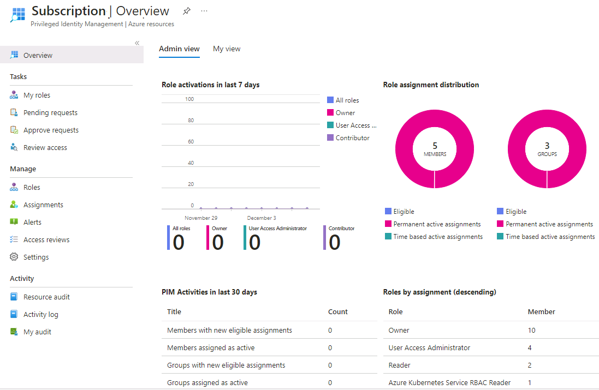

---
lab:
  title: '11: Zuweisen von Azure-Ressourcenrollen in Privileged Identity Management'
  learning path: '02'
  module: Module 02 - Implement an authentication and access management solution
---

# Lab 11: Zuweisen von Azure-Ressourcenrollen in Privileged Identity Management

### Anmeldetyp = Azure Resource-Anmeldung

## Labszenario

Microsoft Entra Privileged Identity Management (Azure AD PIM) kann sowohl die integrierten Azure-Ressourcenrollen als auch benutzerdefinierte Rollen verwalten. Beispiele:

- Besitzer
- Benutzerzugriffsadministrator
- Mitwirkender
- Sicherheitsadministrator
- Sicherheits-Manager

Sie müssen einen Benutzer für eine Azure-Ressourcenrolle als „berechtigt“ festzulegen.

#### Geschätzte Dauer: 10 Minuten

### Übung 1: PIM mit Azure-Ressourcen

#### Aufgabe 1: Zuweisen von Azure-Ressourcenrollen

1. Melden Sie sich mit dem vorgegebenen Administratorkonto bei [https://entra.microsoft.com](https://entra.microsoft.com) an.

2. Suchen und wählen Sie dann **Microsoft Entra Privileged Identity Management** aus.

3. Wählen Sie auf der Seite „Privileged Identity Management“ im linken Navigationsbereich **Azure-Ressourcen** aus.

**Lab-Tipp**: Die nächsten Schritte werden für die Legacy-Azure-Ressourcen-Erfahrung geschrieben.  Sie können oben auf dem Bildschirm zur alten Erfahrung wechseln. Oder Sie können die Übung in der neuen Erfahrung ohne die Schritt-für-Schritt-Anleitung absolvieren.

4. Wählen Sie im Abonnement-Dropdown den Eintrag „MOC Subscription#####“. Wählen Sie dann am unteren Rand des Bildschirms **Ressourcen verwalten**.

5. Wählen Sie auf der Seite "Azure-Ressourcen - Ermittlung" Ihr Abonnement aus.

6. Überprüfen Sie die Informationen auf der Seite **Übersicht**.

   

   **Lab-Tipp**: Aufgrund der Art der Lab-Umgebung werden keine Ressourcen angezeigt. Ein Beispiel finden Sie im Bild.

7. Wählen Sie im linken Navigationsmenü unter **Verwalten** die Option **Rollen** aus, um die Liste der Rollen für Azure-Ressourcen anzuzeigen.

8. Wählen Sie im oberen Menü **+ Zuweisungen hinzufügen** aus.

9. Wählen Sie auf der Seite „Zuweisungen hinzufügen“ das Menü **Rolle auswählen** aus, und wählen Sie dann **API-Verwaltungsdienstmitwirkender** aus.

10. Wählen Sie unter **Mitglied(er) auswählen** die Option **Keine Mitglieder ausgewählt** aus.

11. Suchen Sie im Feld „Mitglied oder Gruppe auswählen“ nach den Admin-Rollen **User1-######@LODSPRODMCA.onmicrosoft.com** aus Ihrer Organisation, denen die Rolle zugewiesen werden soll.  Wählen Sie anschließend **Auswählen** aus.

12. Wählen Sie **Weiter** aus.

13. Wählen Sie auf der Registerkarte **Einstellungen** unter **Zuweisungstyp** die Option **Berechtigt** aus.

   - Für **berechtigte** Zuweisungen muss das Mitglied der Rolle eine Aktion durchführen, um die Rolle verwenden zu können. Beispiele für Aktionen sind eine erfolgreiche Überprüfung der Multi-Faktor-Authentifizierung (MFA), die Angabe einer geschäftlichen Begründung oder das Anfordern einer Genehmigung von den angegebenen genehmigenden Personen.

   - Für **aktive** Zuweisungen ist es nicht erforderlich, dass das Mitglied eine Aktion durchführt, um die Rolle nutzen zu können. Bei als aktiv zugewiesenen Mitgliedern sind die Berechtigungen immer der Rolle zugewiesen.

14. Geben Sie die Zuweisungsdauer an, indem Sie den Start- und Endzeitpunkt für Datum und Uhrzeit ändern.

15. Wählen Sie abschließend **Zuweisen** aus.

16. Nachdem die neue Rollenzuweisung erstellt wurde, wird eine Statusbenachrichtigung angezeigt.

#### Aufgabe 2: Aktualisieren oder Entfernen der Zuweisung einer vorhandenen Ressourcenrolle

**Hinweis**: Aufgrund der Sicherheitseinstellungen in diesem Lab können Sie diese Schritte nicht ausführen.  Bitte überprüfen Sie die Schritte in der Benutzeroberfläche, Sie können jedoch keine Änderungen vornehmen.  Wir arbeiten aktiv daran, hierfür eine Lösung zu finden.

Befolgen Sie diese Anweisungen zum Aktualisieren oder Entfernen einer vorhandenen Rollenzuweisung.

1. Öffnen Sie **Microsoft Entra Privileged Identity Management**.

2. Klicken Sie auf **Azure-Ressourcen**.

3. Wählen Sie das zu verwaltende Abonnement aus, um die Übersichtsseite zu öffnen.

4. Wählen Sie unter **Verwalten** die Option **Zuweisungen** aus.

5. Überprüfen Sie auf der Registerkarte **Zuschussfähige Zuweisungen** in der Spalte "Aktion" die verfügbaren Optionen.

6. Wählen Sie **Entfernen**.

7. Überprüfen Sie im Dialogfeld **Entfernen** die Informationen, und wählen Sie **Ja** aus.
