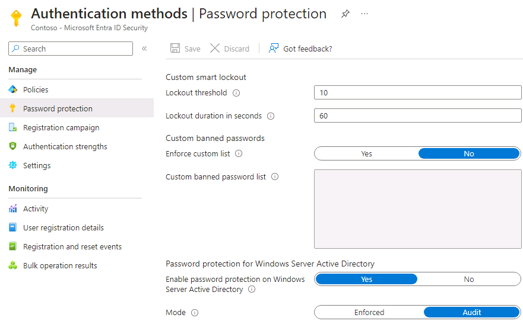

---
lab:
  title: 12 – Verwalten von Smart Lockout-Werten für Microsoft Entra
  learning path: '02'
  module: Module 02 - Implement an Authentication and Access Management Solution
---

# Lab 12 – Verwalten von Smart Lockout-Werten für Microsoft Entra

## Labszenario

Sie müssen die zusätzlichen Kennwortschutzeinstellungen für Ihre Organisation konfigurieren.

#### Geschätzte Dauer: 5 Minuten

### Übung 1 – Verwalten von Smart Lockout-Werten für Microsoft Entra

#### Aufgabe – Smart Lockouts hinzufügen

Sie können die Werte für Microsoft Entra Smart Lockout auf die Anforderungen Ihrer Organisation abstimmen. Wenn Sie die Smart Lockout-Einstellungen mit spezifischen Werten für Ihre Organisation konfigurieren möchten, benötigen Sie mindestens Microsoft Entra ID Premium P1-Lizenzen für Ihre Benutzer.

1. Gehen Sie zu [https://entra.microsoft.com](https://entra.microsoft.com) und melden Sie sich mit einem globalen Administratorkonto für das Verzeichnis an.

2. Öffnen Sie das Portalmenü, und wählen Sie dann  **Identität** aus.

3. Öffnen Sie im Menü „Identität“ das Menü **Schutz**.

4. Wählen Sie im linken Navigationsbereich **Authentifizierungsmethoden** aus.

5. Wählen Sie dann **Kennwortschutz**.

    

6. Legen Sie in den Einstellungen für den Kennwortschutz im Feld **Sperrdauer in Sekunden** den Wert auf **120** fest.

7. Wählen Sie neben **Modus** die Option **Erzwungen** aus.

8. Speichern Sie die Änderungen.

    **HINWEIS**: Wenn der Schwellenwert von Smart Lockout ausgelöst wird, wird das Konto gesperrt und die folgende Meldung angezeigt:
    - Ihr Konto wurde vorübergehend gesperrt, um eine unbefugte Nutzung zu verhindern. Versuchen Sie es später noch mal. Wenden Sie sich an Ihren Administrator, wenn das Problem weiterhin besteht.

9. Dies kann getestet werden, indem Sie eine*n Benutzer*in in Ihrem Microsoft Entra-Mandanten auswählen, in einem privaten Browser zu <login.microsoftonline.com> navigieren und ein falsches Kennwort eingeben, bis das Konto die Benachrichtigung erhält, dass es gesperrt ist.
