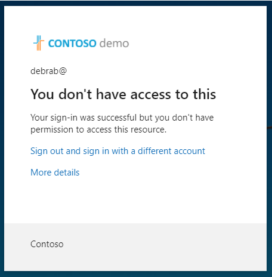

---
lab:
  title: '13: Implementieren und Testen einer Richtlinie für bedingten Zugriff'
  learning path: '02'
  module: Module 02 - Implement an Authentication and Access Management Solution
---

# Lab 13: Implementieren und Testen einer Richtlinie für bedingten Zugriff

### Anmeldetyp = Microsoft 365 Admin

## Labszenario

Ihre Organisation muss den Benutzerzugriff auf seine internen Anwendungen einschränken können. Sie müssen eine Richtlinie für bedingten Zugriff von Microsoft Entra bereitstellen.

**Hinweis**: Bei den Richtlinien für den bedingten Zugriff können Sie die Sicherheitsstandards deaktivieren; die wichtigsten Punkte, die Sie sich merken sollten, stammen aus der Schulung.  Weitere Informationen zu den Sicherheitsstandards finden Sie unter diesem Link: <https://docs.microsoft.com/en-us/azure/active-directory/fundamentals/concept-fundamentals-security-defaults>

#### Geschätzte Dauer: 20 Minuten

### Übung 1 – Festlegen einer Richtlinie für bedingten Zugriff, um den Zugriff von DebraB auf Sway zu blockieren

#### Aufgabe 1 – Bestätigen Sie, dass DebraB Zugriff auf Sway hat

1. Öffnen Sie ein neues InPrivate-Browserfenster.
2. Stellen Sie eine Verbindung mit [https://www.office.com](https://www.office.com) her. 
3. Melden Sie sich bei Aufforderung als DebraB an:

  | Einstellung | Wert |
  | :--- | :--- |
  | Username | **DebraB@** `<<your lab domain>>.onmicrosoft.com` |
  | Kennwort | Geben Sie das Administratorkennwort des Mandanten ein (Sie finden das Administratorkennwort des Mandanten auf der Registerkarte „Labressourcen“) |
    
4. Umgehen Sie die Willkommens- und Einführungsbildschirme.

5. Öffnen Sie die **Apps**-Seite und wählen Sie dann das **Sway**-Symbol aus, um zu sehen, ob es korrekt geladen wird.

6. Melden Sie sich bei Office ab, und schließen Sie Ihre Browsersitzung.

#### Aufgabe 2: Erstellen einer Richtlinie für bedingten Zugriff

Der bedingte Zugriff von Microsoft Entra ist ein erweitertes Feature von Microsoft Entra ID, mit dem Sie detaillierte Richtlinien angeben können, die steuern, wer auf Ihre Ressourcen zugreifen kann. Mithilfe des bedingten Zugriffs können Sie Ihre Anwendungen schützen, indem Sie den Zugriff der Benutzer auf Grundlage von Faktoren wie Gruppen, Gerätetyp, Standort und Rolle einschränken.

1. Navigieren Sie zu [https://entra.microsoft.com](https://entra.microsoft.com), und melden Sie sich mit dem Konto eines globalen Administrators für das Verzeichnis an.

2. Öffnen Sie das Portalmenü, und wählen Sie dann  **Microsoft Entra ID** aus.

3. Wählen Sie im Menü unter **Identität** **Schutz** aus.

4. Wählen Sie auf der Seite „Sicherheit“ im linken Navigationsbereich **Bedingter Zugriff** aus.

5. Klicken Sie auf der **Übersicht (Vorschau)** auf **+ Neue Richtlinie** erstellen.

   

6. Geben Sie im Feld **Name** **Block Sway für DebraB** ein.

   **Hinweis**: Anhand dieser Benennung erkennen Sie schnell die Richtlinie und deren Funktion.

7. Wählen Sie unter **Zuweisungen** **0 Benutzer und Gruppen ausgewählt** aus.

8. Wählen Sie auf der Registerkarte „Einschließen“ die Option **Benutzer und Gruppen auswählen** aus und markieren Sie dann das Kontrollkästchen **Benutzer und Gruppen**.

9. Wählen Sie im Bereich „Auswählen“ **DebraB** und dann **Auswählen** aus.

10. Wählen Sie in unter **Zielressourcen** **Keine Zielressource ausgewählt** aus.

11. Vergewissern Sie sich, dass **Cloud-Apps** ausgewählt ist, und wählen Sie dann **Apps auswählen** aus, und wählen Sie dann im Abschnitt „Auswählen“ **Keine** aus.

12. Suchen Sie im Bereich „Auswählen“ nach **Sway**, wählen Sie **Sway** aus, und klicken Sie dann auf **Auswählen**.

13. Wählen Sie unter **Access-Steuerelemente** im Abschnitt **Erteilen** **0 Steuerelemente ausgewählt** aus.

14. Wählen Sie im Bereich „Gewähren“ die Option **Zugriff blockieren** und dann **Auswählen** aus.

   **Hinweis**: Diese Richtlinie wird nur für die Übung konfiguriert und dient zum schnellen Veranschaulichen einer Richtlinie für bedingten Zugriff.

15. Wählen Sie unter **Richtlinie aktivieren** die Option **Ein** und dann **Erstellen** aus.

   

#### Aufgabe 3: Testen der Richtlinie für bedingten Zugriff

Sie sollten Ihre Richtlinien für bedingten Zugriff testen, um sicherzustellen, dass sie erwartungsgemäß funktionieren.

1. Öffnen Sie eine neue InPrivate-Browserregisterkarte und navigieren Sie dann zu [https://sway.office.com](https://sway.office.com).
    - Melden Sie sich bei Aufforderung als DebraB an:

   | Einstellung | Wert |
   | :--- | :--- |
   | Username | **DebraB@** `<<your lab domain>>.onmicrosoft.com` |
   | Kennwort | Geben Sie das Administratorkennwort des Mandanten ein (Sie finden das Administratorkennwort des Mandanten auf der Registerkarte „Labressourcen“) |
     
2. Stellen Sie sicher, dass Sie nicht auf Microsoft Sway zugreifen können.

   

3. Wenn Sie angemeldet sind, schließen Sie die Registerkarte, warten Sie eine Minute, und wiederholen Sie dann den Vorgang.
    
   **Hinweis**: Wenn Sie automatisch als DebraB bei Sway angemeldet sind, müssen Sie sich manuell abmelden.  Ihre Anmeldeinformationen/Zugriff wurden zwischengespeichert.  Sobald Sie sich abmelden und sich anmelden, sollte Ihre Sway-Sitzung den Zugriff verweigern.

4. Schließen Sie die Registerkarte, und kehren Sie zur Seite „Bedingter Zugriff“ zurück.

5. Wählen Sie die Richtlinie **Block Sway für die DebraB** aus.

6. Wählen Sie unter **Richtlinie aktivieren** die Option **Aus** und dann **Speichern** aus.

### Übung 2: – Testen von Richtlinien für bedingten Zugriff mit „What If“

#### Aufgabe: Verwenden von „What If“-zum Testen von Richtlinien für bedingten Zugriff

1. Öffnen Sie das Microsoft Entra Admin Center-Menü und wählen Sie dann  **Microsoft Entra ID** aus.

1. Wählen Sie im Menü unter **Identität** **Schutz** aus.

1. Wählen Sie auf der Seite „Sicherheit“ im linken Navigationsbereich **Bedingter Zugriff** aus.

1. Wählen Sie im Navigationsbereich **Richtlinien** aus.

1. Wählen Sie **What If** aus.

1. Wählen Sie unter **User or Workload identity** den Eintrag **No user or service principal selected** aus.

1. Wählen Sie **DebraB** als Benutzer aus.

1. Wählen Sie unter**Cloud-Apps, Aktionen oder Authentifizierungskontext** **Sway** aus. 

1. Wählen Sie **What if** aus. Am unteren Rand der Kachel wird ein Bericht für **Anzuwendende Richtlinien** und **Nicht anzuwendende Richtlinien**.

Auf diese Weise können Sie die Richtlinien und deren Affektivität testen, bevor Sie die Richtlinien aktivieren.

### Übung 3: Konfigurieren von Steuerelementen für Anmeldehäufigkeit mithilfe einer Richtlinie für bedingten Zugriff

#### Aufgabe: Verwenden Sie das Microsoft Entra Admin Center zum Konfigurieren des bedingten Zugriffs

Im Rahmen der größeren Sicherheitskonfiguration Ihres Unternehmens müssen Sie eine Richtlinie für bedingten Zugriff testen, mit der die Anmeldehäufigkeit gesteuert werden kann.

1. Navigieren Sie zu [https://entra.microsoft.com](https://entra.microsoft.com), und melden Sie sich mit dem Konto eines globalen Administrators für das Verzeichnis an.

2. Öffnen Sie das Portalmenü, und wählen Sie dann  **Microsoft Entra ID** aus.

3. Wählen Sie im Menü unter **Identität** **Schutz** aus.

4. Wählen Sie im Menü „Schutz“ im linken Navigationsbereich **Bedingten Zugriff** aus.

5. Wählen Sie oben im Menü **+ Neue Richtlinie** und im Dropdownmenü **Neue Richtlinie erstellen** aus.

   

6. Geben Sie im Feld **Name** die Bezeichnung **Anmeldehäufigkeit** ein.

7. Wählen Sie unter **Zuweisungen** **0 Benutzer und Gruppen ausgewählt** aus.

8. Markieren Sie auf der Registerkarte „Einschließen“ **Benutzer und Gruppen auswählen** und aktivieren Sie dann das Kontrollkästchen **Benutzer und Gruppen**.

9. Wählen Sie im Bereich „Auswählen“ das Konto **Grady Archie** und dann **Auswählen** aus.

10. Wählen Sie **Zielressourcen – Keine Zielressourcen ausgewählt** aus.

11. Innerhalb von **Einschließen** vergewissern Sie sich, dass **Ressourcen auswählen** markiert ist und wählen Sie dann **Keine** im Auswahl-Abschnitt.

12. Wählen Sie im Bereich „Auswählen“ die Option **Office 365** und dann **Auswählen** aus.

13. Wählen Sie unter **Zugriffssteuerungen** die Option **Sitzung** aus.

14. Wählen Sie im Bereich „Sitzung“ die Option **Anmeldehäufigkeit** aus.

15. Geben Sie im Wertfeld die Zahl **30** ein.

16. Wählen Sie das Menü „Einheiten“, dann **Tage** und anschließend **Auswählen** aus.

17. Wählen Sie unter **Richtlinie aktivieren** die Option **Nur Bericht** und dann **Erstellen** aus.

   

   **HINWEIS**: Der reine Berichtsmodus ist ein neuer Status von Richtlinien für bedingten Zugriff, mit dem Administratoren die Auswirkungen von Richtlinien für bedingten Zugriff auswerten können, bevor sie die jeweiligen Richtlinien in ihrer Umgebung aktivieren. Durch die Einführung des reinen Berichtsmodus ergeben sich die folgenden Vorteile:
    
- Richtlinien für bedingten Zugriff können im reinen Berichtsmodus aktiviert werden.
- Bei der Anmeldung werden Richtlinien im reinen Berichtsmodus ausgewertet, aber nicht erzwungen.
- Die Ergebnisse werden auf den Registerkarten Bedingter Zugriff und Nur melden der Anmeldeprotokolldetails protokolliert.
- Kunden mit einem Azure Monitor-Abonnement können die Auswirkungen ihrer Richtlinien für bedingten Zugriff mithilfe der Arbeitsmappe für Erkenntnisse zum bedingten Zugriff überwachen.
