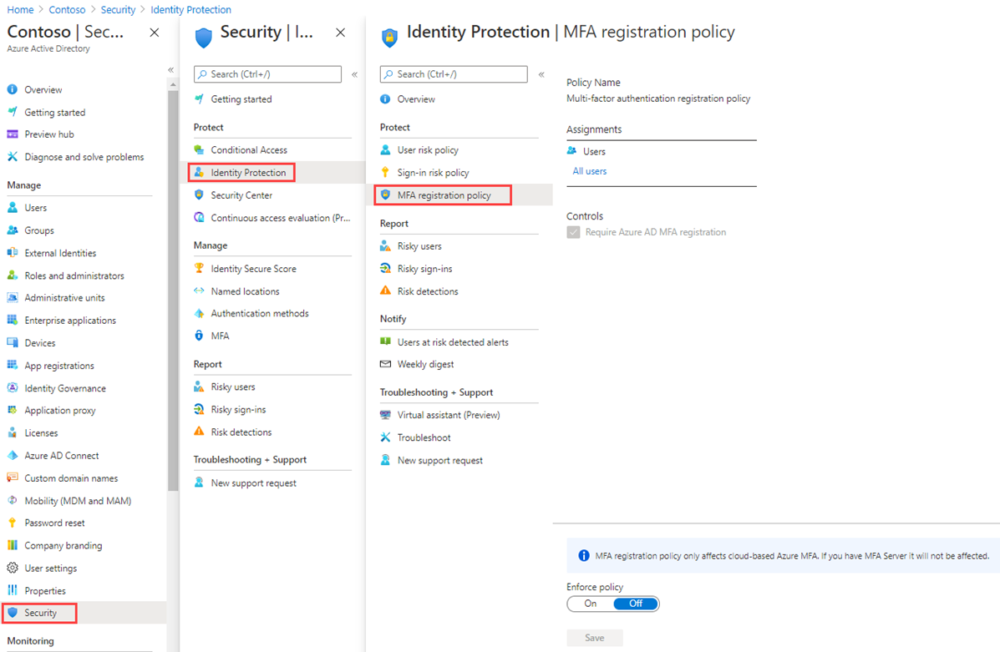

---
lab:
  title: 15 - Konfigurieren einer Registrierungsrichtlinie für die Multifaktor-Authentifizierung
  learning path: '02'
  module: Module 02 - Implement an Authentication and Access Management Solution
---

# Übung 15 - Konfigurieren einer Registrierungsrichtlinie für die Multifaktor-Authentifizierung

## Labszenario

Mit Multi-Faktor-Authentifizierung können Sie über die Verwendung eines Benutzernamens und Kennworts hinaus Ihre Identität verifizieren. Sie bietet eine zweite Sicherheitsebene für Benutzeranmeldungen. Damit Benutzer*innen auf MFA-Aufforderungen reagieren können, müssen sie sich zunächst für Microsoft Entra Multifactor Authentication registrieren. Sie müssen die MFA-Registrierungsrichtlinie Ihrer Microsoft Entra-Organisation so konfigurieren, dass sie allen Benutzer*innen zugewiesen wird.

#### Geschätzte Dauer: 10 Minuten

### Übung 1: Einrichten der MFA-Registrierungsrichtlinie

#### Aufgabe 1: Richtlinienkonfiguration

1. Melden Sie sich mit dem globalen Administratorkonto bei [https://entra.microsoft.com]( https://entra.microsoft.com) an.

2. Öffnen Sie das Portalmenü, und wählen Sie dann  **Microsoft Entra ID** aus.

3. Wählen Sie auf der linken Seite unter **Identität** **Schutz**.

4. Wählen Sie auf der Seite „Sicherheit“ im linken Navigationsbereich **Identity Protection** aus.

5. Wählen Sie auf der Seite „Identity Protection“ im linken Navigationsbereich unter **Schützen** die Option **MFA-Registrierungsrichtlinie** aus.

    

6. Unter **Zuweisungen**

7. Wählen Sie unter **Zuweisungen** die Option **Alle Benutzer** aus, und überprüfen Sie die verfügbaren Optionen.

8. Zur Auswahl stehen **Alle Benutzer** oder **Einzelne Benutzer und Gruppen auswählen**, falls Sie den Rollout einschränken möchten.

9. Außerdem können Sie festlegen, dass Benutzer von der Richtlinie ausgeschlossen werden sollen.

10. Beachten Sie, dass unter **Steuerungen** die Option **Microsoft Entra ID-MFA-Registrierung als erforderlich festlegen** ausgewählt ist und nicht geändert werden kann.

#### Aufgabe 2 - Konfigurieren der Microsoft Entra Identity Protection-Richtlinie für die MFA-Registrierung

**Hinweis**: Für Microsoft Entra Identity Protection muss Microsoft Entra ID Premium P2 aktiviert sein. 

1. Navigieren Sie im Microsoft Entra Admin Center in der Suchleiste zu **Microsoft Entra Identity Protection**.

1. Wählen Sie im Menü unter **Schutz** die Option **Registrierungsrichtlinie für die Multifaktorauthentifizierung**.

1. Wählen Sie unter **Zuweisungen** die Option **Alle Benutzer** unter Benutzer und wählen Sie einen Benutzer*in, der MFA erzwingen soll.

1. Ändern Sie **Richtliniendurchsetzung** von **Deaktiviert** in **Aktiviert**.

1. Wählen Sie **Speichern**.

Auf diese Weise muss der Benutzer die MFA-Registrierung beim nächsten Anmeldeversuch abschließen.

1. Navigieren Sie in einem privaten Browser zu `https://login.microsoftonline.com`. Geben Sie einen Benutzernamen und ein Kennwort ein.  Beachten Sie die zusätzlichen Sicherheitsinformationen, die der Benutzer eingeben muss.
