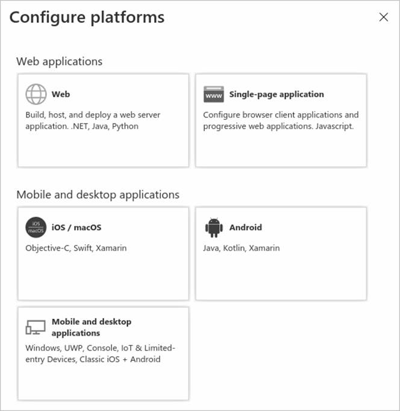

---
lab:
  title: '19: Registrieren einer Anwendung'
  learning path: '03'
  module: Module 03 - Implement Access Management for Apps
---

# Lab 19: Registrieren einer Anwendung

### Anmeldetyp = Microsoft 365 Admin

#### Geschätzte Dauer: 30 Minuten

### Übung 1: Registrieren einer Anwendung

#### Aufgabe 1: App-Registrierung

Bei der Registrierung Ihrer Anwendung wird eine Vertrauensstellung zwischen Ihrer App und Microsoft Identity Platform erstellt. Die Vertrauensstellung ist unidirektional: Ihre App vertraut Microsoft Identity Platform und nicht umgekehrt.

1. Melden Sie sich bei [https://entra.microsoft.com](https://entra.microsoft.com)  mit einem globalen Administratorkonto an.

2. Öffnen Sie das Portalmenü, und wählen Sie dann  **Microsoft Entra ID** aus.

3. Wählen Sie im Menü **Identität** unter **Anwendungen** **App-Registrierungen** aus.

4. Wählen Sie auf der Seite **App-Registrierungen** im Menü die Option **+ Neue Registrierung** aus.

5. Registrieren Sie auf dem Blatt **Anwendung registrieren** unter Verwendung der Standardwerte eine App mit dem Namen **Demo-App**. Der Umleitungs-URI muss nicht eingegeben werden.

    

6. Sie wählen die Schaltfläche **Registrieren** aus.

7. Wenn Sie fertig sind, werden Sie zur Seite **Demo-App** weitergeleitet.

#### Aufgabe 2: Konfigurieren von Plattformeinstellungen

Die Einstellungen für jeden Anwendungstyp (einschließlich Umleitungs-URIs) werden unter  **Plattformkonfigurationen** im Azure-Portal konfiguriert. Bei einigen Plattformen (wie  **Web** - und  **Single-Page-Webanwendungen**) müssen Sie manuell einen Umleitungs-URI angeben. Bei anderen Plattformen (z. B. mobile Anwendungen und Desktopanwendungen) stehen Umleitungs-URIs zur Auswahl, die beim Konfigurieren anderer Einstellungen für Sie generiert wurden.

So konfigurieren Sie Anwendungseinstellungen auf Basis der Zielplattform oder des Zielgeräts

Sie können Umleitungs-URIs für Ihre registrierten Anwendungen hinzufügen und ändern, indem Sie deren Plattformeinstellungen konfigurieren.

1. Wählen Sie im Microsoft Entra Admin Center unter  **App-Registrierungen** Ihre Anwendung aus.

2. Wählen Sie unter  **Verwalten** die Option  **Authentifizierung** aus.

3. Wählen Sie unter  **Plattformkonfigurationen** die Option  **+ Plattform hinzufügen** aus.

4. Wählen Sie unter  **Plattformen konfigurieren** die Kachel für Ihren Anwendungstyp (Plattform) aus, um die Einstellungen zu konfigurieren.

    

    | Plattform| Konfigurationseinstellungen|
    | :--- | :--- |
    | Web| Geben Sie einen  **Umleitungs-URI** für Ihre App ein. Dabei handelt es sich um die Adresse, an die Microsoft Identity Platform den Client eines Benutzers umleitet und nach der Authentifizierung die Sicherheitstoken sendet. Wählen Sie diese Plattform für Standardwebanwendungen aus, die auf einem Server ausgeführt werden.|
    | Einseitige Anwendung| Geben Sie einen  **Umleitungs-URI** für Ihre App ein. Dabei handelt es sich um die Adresse, an die Microsoft Identity Platform den Client eines Benutzers umleitet und nach der Authentifizierung die Sicherheitstoken sendet. Wählen Sie diese Plattform aus, wenn Sie eine clientseitige Web-App in JavaScript oder mit einem Framework wie Angular, Vue.js, React.js oder Blazor WebAssembly erstellen.|
    | iOS/macOS| Geben Sie die  **Paket-ID** der App ein, die Sie in XCode in  *Info.plist* oder unter „Build Settings“ finden. Wenn Sie eine Paket-ID angeben, wird ein Umleitungs-URI für Sie generiert.|
    | Android| Geben Sie den  **Paketnamen** der App ein, den Sie in der Datei „AndroidManifest.xml“ finden. Generieren Sie den  **Signaturhash**, und geben Sie ihn ein. Bei der Angabe dieser Einstellungen wird ein Umleitungs-URI für Sie generiert.|
    | Mobile Anwendungen und Desktopanwendungen| Wählen Sie unter  **Vorgeschlagene Umleitungs-URIs** einen der Umleitungs-URIs aus, oder geben Sie in das Feld  **Benutzerdefinierter Umleitungs-URI** einen URI ein. Empfehlung für Desktopanwendungen: [https://login.microsoftonline.com/common/oauth2/nativeclient](https://login.microsoftonline.com/common/oauth2/nativeclient). Wählen Sie diese Plattform für mobile Anwendungen aus, die nicht die neueste Microsoft-Authentifizierungsbibliothek (Microsoft Authentication Library, MSAL) verwenden oder keinen Broker einsetzen. Wählen Sie diese Plattform auch für Desktopanwendungen aus.|

5. Wählen Sie **Web** als Ihre Plattform.

6. Geben Sie `https://localhost` als die Umleitungs-URI ein.

7. Wählen Sie  **Konfigurieren** aus, um die Plattformkonfiguration abzuschließen.

#### Aufgabe 3: Hinzufügen der Anmeldeinformationen, des Zertifikats und des geheimem Clientschlüssels

Anmeldeinformationen werden von vertraulichen Clientanwendungen verwendet, die auf eine Web-API zugreifen. Beispiele für vertrauliche Clients sind Web-Apps, andere Web-APIs oder Anwendungen des Typs „Dienst“ oder „Daemon“. Mit den Anmeldeinformationen kann sich Ihre Anwendung selbst authentifizieren und benötigt zur Laufzeit keine Interaktion durch einen Benutzer.

Sie können Ihrer vertraulichen Client-App-Registrierung sowohl Zertifikate als auch geheime Clientschlüssel (Zeichenfolge) als Anmeldeinformationen hinzufügen.


    **Note**: Sometimes called a *public key*, certificates are the recommended credential type, because as they provide a higher level of assurance than a client secret. When using a trusted public certificate, you can add the certificate using the Certificates & secrets feature. Your certificate must be one of the following file types: .cer, .pem, .crt.


    **Note**: The client secret, also known as an *application password*, is a string value your app can use in place of a certificate to identity itself. It's the easier of the two credential types to use. It's often used during development, but is considered less secure than a certificate. You should use certificates in your applications running in production.

1. Wählen Sie im Azure-Portal unter  **App-Registrierungen**  Ihre Anwendung aus.

2. Wählen Sie unter  **Zertifikate und Geheimnisse** die Option  **+ Neuer geheimer Clientschlüssel** aus.

3. Fügen Sie eine Beschreibung für das Geheimnis Ihres Clients und die Dauer hinzu

 - Beschreibung = SC300 Lab-Geheimnis
 - Dauer = 90 Tage (3 Monate)

4. Wählen Sie  **Hinzufügen** aus.

5. **Speichern Sie den Wert des geheimen Schlüssels im Editor** für die Verwendung in Ihrem Clientanwendungscode. Auf der Seite „Zertifikat und Geheimnisse“ wird der neue Geheimniswert angezeigt. Es ist wichtig, dass Sie diesen Wert kopieren, da er nur dieses eine Mal angezeigt wird. Wenn Sie die Seite verlassen und zurückkehren, wird er nur noch als maskierter Wert angezeigt.

Nachdem Sie Ihre Web-API registriert haben, können Sie die Bereiche hinzufügen, mit denen der Code Ihrer API eine differenzierte Berechtigung für Nutzende Ihrer API bereitstellen kann.

#### Aufgabe 5: Hinzufügen eines Bereichs

Der Code in einer Clientanwendung fordert die Berechtigung zum Ausführen von Vorgängen an, die von Ihrer Web-API definiert werden, indem er zusammen mit seinen Anforderungen ein Zugriffstoken an die geschützte Ressource (die Web-API) übergibt. Ihre Web-API führt anschließend den angeforderten Vorgang nur dann aus, wenn das empfangene Zugriffstoken die für den Vorgang erforderlichen Bereiche (auch als Anwendungsberechtigungen bezeichnet) enthält.

Führen Sie zuerst die folgenden Schritte aus, um einen Beispielbereich namens „Employees.Read.All“ zu erstellen:

1. Wählen Sie  **Identität**, dann **Anwendung** und schließlich  **App-Registrierungen** und wählen Sie dann die App-Registrierung Ihrer API.

2. Wählen Sie  **Eine API verfügbar machen** und dann  **+ Bereich hinzufügen** aus.

    

3. Sie werden aufgefordert, eine **Anwendungs-ID URI** festzulegen. Festlegen des Werts auf **api://DemoAppAPI**

  - Hinweis: Der APP-ID-URI fungiert als Präfix für die Bereiche, auf die Sie in Ihrem API-Code verweisen, und muss global eindeutig sein. Sie können den bereitgestellten Standardwert in der Form api://<application-client-id\> verwenden oder eine besser lesbare URI wie  `https://contoso.com/api` angeben.

4. Wählen Sie **Speichern und fortfahren** aus.

5. Geben Sie als Nächstes unter  **Bereich hinzufügen** die Attribute des Bereichs an. Für diesen Durchgang verwenden Sie die Werte in der 3. Spalte: **Wert**.

    | Feld| Beschreibung| Wert |
    | :--- | :--- | :--- |
    | Bereichsname| Name des Bereichs. Eine allgemeine Benennungskonvention für den Bereich ist „Ressource.Vorgang.Einschränkung“.| Employees.Read.All|
    | Zum Einwilligen berechtigte Personen| Gibt an, ob für diesen Bereich die Einwilligung von Benutzern ausreicht oder die Einwilligung eines Administrators erforderlich ist. Wählen Sie für umfassendere Berechtigungen die Option „Nur Administratoren“ aus.| Administratoren und Benutzer|
    | Anzeigename der Administratoreinwilligung| Eine kurze Beschreibung des Zwecks für den Bereich, der nur Administratoren angezeigt wird.| Schreibgeschützter Zugriff auf Mitarbeiterdatensätze|
    | Beschreibung der Administratoreinwilligung| Eine ausführlichere Beschreibung der vom Bereich gewährten Berechtigung, die nur Administratoren angezeigt wird.| Ermöglicht der Anwendung einen schreibgeschützten Zugriff auf alle Mitarbeiterdaten.|
    | Anzeigename der Benutzereinwilligung| Eine kurze Beschreibung des Zwecks für den Bereich. Wird Benutzern nur angezeigt, wenn Sie unter Zum Einwilligen berechtigte Personen die Option Administratoren und Benutzer festgelegt haben.| Schreibgeschützter Zugriff auf Mitarbeiterdatensätze|
    | Beschreibung der Benutzereinwilligung| Eine ausführlichere Beschreibung der Berechtigung, die vom Bereich gewährt wird. Wird Benutzern nur angezeigt, wenn Sie unter Zum Einwilligen berechtigte Personen die Option Administratoren und Benutzer festgelegt haben.| Ermöglichen Sie der Anwendung einen schreibgeschützten Zugriff auf Ihre Mitarbeiterdaten.|

7. Legen Sie den **Status** auf **Aktiviert** fest, und wählen Sie dann  **Bereich hinzufügen** aus.

8. (Optional) Soll Benutzern Ihrer App keine Einwilligungsaufforderung für die von Ihnen festgelegten Bereiche angezeigt werden, können Sie die Clientanwendung für den Zugriff auf Ihre Web-API  *vorab autorisieren* . Sie sollten  *nur* die Clientanwendungen vorab autorisieren, denen Sie vertrauen, da Ihre Benutzer keine Möglichkeit haben, ihre Einwilligung zu verweigern.

   1. Wählen Sie unter  **Autorisierte Clientanwendungen** die Option  **Eine Clientanwendung hinzufügen** aus.

   2. Geben Sie den Wert für  **Anwendungs-ID (Client)** der Clientanwendung ein, die Sie vorab autorisieren möchten, beispielsweise den einer zuvor registrierten Webanwendung.

   3. Wählen Sie unter  **Autorisierte Bereiche** die Bereiche aus, für die Sie die Einwilligungsaufforderung unterdrücken möchten, und wählen Sie dann  **Anwendung hinzufügen** aus.

   4. Wenn Sie diesen optionalen Schritt ausgeführt haben, ist die Client-App jetzt eine vorab autorisierte Client-App, und Benutzer werden bei der Anmeldung nicht zur Einwilligung aufgefordert.

#### Aufgabe 6: Hinzufügen eines Bereichs, für den eine Administratoreinwilligung erforderlich ist

Fügen Sie als Nächstes einen weiteren Beispielbereich namens „Employees.Write.All“ hinzu, dem nur Administratoren die Einwilligung erteilen können. Bereiche, die die Einwilligung von Administratoren benötigen, werden in der Regel für den Zugriff auf Vorgänge mit erforderlichen höheren Berechtigungen verwendet. Außerdem werden sie häufig von Clientanwendungen verwendet, die als Back-End-Dienste oder Daemons ausgeführt werden und keine Benutzer interaktiv anmelden.

1. Um den Beispielbereich „Employees.Write.All“ hinzuzufügen, führen Sie die oben beschriebenen Schritte aus, und geben Sie unter  **Bereich hinzufügen** die folgenden Werte an:

    | Feld| Beispielwert|
    | :--- | :--- |
    | Bereichsname| Employees.Write.All|
    | Zum Einwilligen berechtigte Personen| Nur Administratoren|
    | Anzeigename der Administratoreinwilligung| Schreibzugriff auf Mitarbeiterdatensätze|
    | Beschreibung der Administratoreinwilligung| Ermöglicht der Anwendung Schreibzugriff auf alle Mitarbeiterdaten.|
    | Anzeigename der Benutzereinwilligung| Keine (Feld leer lassen)|
    | Beschreibung der Benutzereinwilligung| Keine (Feld leer lassen)|

2. Stellen Sie sicher, dass der Status auf **Aktiviert** festgelegt ist und wählen Sie dann **Bereich hinzufügen**.

  - **Hinweis**: Wenn Sie die beiden in den vorherigen Abschnitten beschriebenen Beispielbereiche erfolgreich hinzugefügt haben, werden sie, ähnlich wie in der folgenden Abbildung gezeigt, im Bereich  **Eine API verfügbar machen** der App-Registrierung Ihrer Web-API angezeigt:

  

  Wie aus der Abbildung hervorgeht, wird die vollständige Zeichenfolge eines Bereichs durch die Verkettung von  **Anwendungs-ID-URI** der Web-API und  **Bereichsname** des Bereichs gebildet.

  **Hinweis**: Wenn der Anwendungs-ID-URI Ihrer Web-API beispielsweise `https://contoso.com/api` und der Bereichsname „Employees.Read.All“ lautet, ergibt sich daraus die folgende Zeichenfolge für den vollständigen Bereich: `https://contoso.com/api/Employees.Read.All`

  **Hinweis**: Als Nächstes konfigurieren Sie die Registrierung einer Client-App mit Zugriff auf Ihre Web-API und die Bereiche, die Sie mit den obigen Schritten definiert haben.
  Nachdem der Registrierung einer Client-App die Berechtigung für den Zugriff auf Ihre Web-API erteilt wurde, kann Microsoft Identity Platform für den Client ein OAuth 2.0-Zugriffstoken ausstellen. Wenn der Client die Web-API aufruft, präsentiert er ein Zugriffstoken, dessen Bereichsanspruch (scp) auf die Berechtigungen festgelegt ist, die Sie in der Client-App-Registrierung angegeben haben. Sie können später bei Bedarf zusätzliche Bereiche verfügbar machen. Beachten Sie, dass Ihre Web-API mehrere Bereiche verfügbar machen kann, die verschiedenen Vorgängen zugeordnet sind. Ihre Ressource kann zur Laufzeit durch Auswerten der Bereichsansprüche (scp) im erhaltenen OAuth 2.0-Zugriffstoken den Zugriff auf die Web-API steuern.


### Übung 2: Verwalten von App-Registrierungen mit einer benutzerdefinierten Rolle

#### Aufgabe 1: Erstellen einer neuen benutzerdefinierten Rolle für den Zugriff zum Verwalten von App-Registrierungen

Sie müssen eine neue benutzerdefinierte Rolle für die App-Verwaltung erstellen. Diese neue Rolle sollte nur auf die spezifischen Berechtigungen beschränkt sein, die zum Durchführen der Verwaltung von Anmeldeinformationen erforderlich sind.

1. Melden Sie sich bei  [https://entra.microsoft.com](https://entra.microsoft.com)  mit einem globalen Administratorkonto an.

2. Öffnen Sie das Portalmenü, und wählen Sie dann  **Microsoft Entra ID** aus.

3. Wählen Sie im Menü auf der linken Seite unter **Identität** die Option **Rollen und Admins**.

4. Wählen Sie dann das Element **Rollen und Administratoren** und anschließend **+ Neue benutzerdefinierte Rolle** aus.

    

5. Geben Sie im Dialogfeld „Neue benutzerdefinierte Rolle“ auf der Registerkarte „Grundlagen“ im Namensfeld den Namen **My custom app role** ein.

6. Überprüfen Sie die übrigen Einstellungen, und wählen Sie dann **Weiter** aus.

7. Überprüfen Sie die verfügbaren Berechtigungen auf der Registerkarte Berechtigungen.

8. Geben Sie im Feld **Nach Berechtigungsname oder -beschreibung suchen** den Text **Anmeldeinformationen** ein.

9. Wählen Sie in den Ergebnissen die Berechtigungen zum **Verwalten** und dann **Weiter** aus.

    ```
       microsoft.directory/servicePrincipals/managePasswordSingleSignOnCredentials  -   Manage password single sign-on credentials or service principals.
       microsoft.directory/servicePrincipals/synchronizationCredentials/manage    -   Manage application provisioning secrets and credentials.
    ```

    

    **Warum diese beiden Elemente ausgewählt werden**: Für die Bereitstellung sind diese beiden Elemente die einzigen erforderlichen Mindestberechtigungen, um das einmalige Anmelden für die zu erstellende Anwendung oder den Dienstprinzipal zu aktivieren und zu erzwingen sowie um die eingegebene Anwendung einer Gruppe von Benutzern oder Gruppen zuzuweisen.  Andere Berechtigungen können ebenfalls erteilt werden.  Sie können eine vollständige Liste der verfügbaren Berechtigungen unter `https://docs.microsoft.com/azure/active-directory/roles/custom-enterprise-app-permissions` abrufen.

10. Wählen Sie **Weiter** aus.

11. Überprüfen Sie die Änderungen, und wählen Sie dann **Erstellen** aus.

