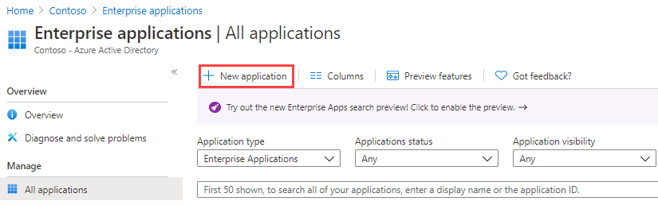

---
lab:
  title: '20: Implementieren der Zugriffsverwaltung für Apps'
  learning path: '03'
  module: Module 03 - Implement Access Management for Apps
---

# Lab 20: Implementieren der Zugriffsverwaltung für Apps

## Labszenario

Ihre Organisation erfordert, dass nur bestimmte Benutzer*innen oder Gruppen Zugriff auf Unternehmensanwendungen haben. Sie müssen einer bestimmten Anwendung einen Benutzer zuweisen.

#### Geschätzte Dauer: 5 Minuten

### Übung 1: Konfigurieren einer Unternehmens-App

#### Aufgabe 1: Hinzufügen einer App zu Ihrem Microsoft Entra-Mandanten

1. Melden Sie sich bei  [https://entra.microsoft.com](https://entra.microsoft.com)  mit einem globalen Administratorkonto an.

2. Öffnen Sie das Portalmenü, und wählen Sie dann  **Microsoft Entra ID** aus.

3. Wählen Sie im Menü „Identität“ unter **Anwendungen** die Option **Unternehmensanwendungen** aus.

4. Wählen Sie im Bereich „Unternehmensanwendungen“ die Option **+ Neue Anwendung** aus.

    

5. Geben Sie auf der Seite „Microsoft Entra-Katalog durchsuchen“ im Feld **Anwendung suchen** den Begriff **GitHub** ein.

    

6. Wählen Sie in den Ergebnissen **GitHub Enterprise Cloud – Enterprise Account** aus.

7. Überprüfen Sie die Einstellungen unter **GitHub Enterprise Cloud – Enterprise Account**, und wählen Sie dann **Erstellen** aus.

8. Nachdem der Erstellung werden Sie zur Seite „GitHub Enterprise Cloud – Enterprise Account“ umgeleitet.

#### Aufgabe 2: Zuweisen von Benutzer*innen zu einer App

1. Wählen Sie auf dem Bildschirm „GitHub Enterprise Cloud – Enterprise Account“ auf der Seite „Übersicht“ unter **Erste Schritte** die Option **1. Benutzer und Gruppen zuweisen** aus.

2. Alternativ können Sie im Navigationsbereich auf der linken Seite unter **Verwalten** die Option **Benutzer und Gruppen** auswählen.

3. Wählen Sie auf der Seite „Benutzer und Gruppen“ im Menü **+ Benutzer/Gruppe hinzufügen** aus.

4. Wählen Sie auf der Seite „Zuweisung hinzufügen“ im Abschnitt **Benutzer und Gruppen** die Option **Keine ausgewählt** aus.

5. Wählen Sie im Bereich „Benutzer und Gruppen“ Ihr Administratorkonto und dann **Auswählen** aus.

    

6. Wählen Sie **Zuweisen** aus.

