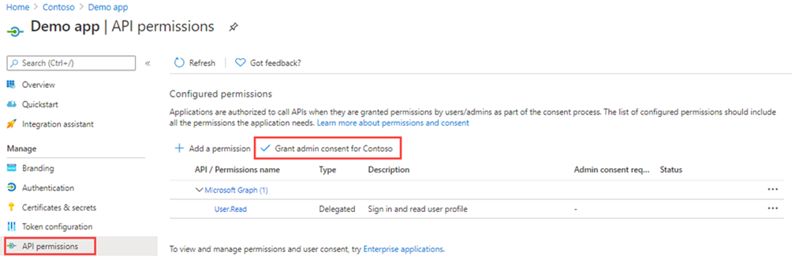

---
lab:
  title: '21: Erteilen einer mandantenweiten Administratoreinwilligung für eine Anwendung'
  learning path: '03'
  module: Module 03 - Implement Access Management for Apps
---

# Lab 21: Erteilen einer mandantenweiten Administratoreinwilligung für eine Anwendung

## Labszenario

Bei Anwendungen, die Ihre Organisation entwickelt hat oder die direkt in Ihrem Azure AD-Mandanten registriert sind, können Sie auch im Azure-Portal in „App-Registrierungen“ eine mandantenweite Administratoreinwilligung erteilen.

#### Geschätzte Dauer: 15 Minuten

### Übung 1: Administratorzustimmung

#### Aufgabe 1: Erteilen der Administratoreinwilligung in App-Registrierungen

   **Warnung**: Die Erteilung einer mandantenweiten Administratoreinwilligung für eine Anwendung gewährt der App und ihrem Herausgeber Zugriff auf die Daten Ihrer Organisation. Überprüfen Sie vor dem Erteilen einer Einwilligung sorgfältig die Berechtigungen, die von der Anwendung angefordert werden.

Die Rolle „Globaler Administrator“ ist erforderlich, um die Administratoreinwilligung für die Anwendungsberechtigungen für die Microsoft Graph-API zu erteilen.

1. In einer vorherigen Übung haben Sie eine App mit dem Namen „Demo-App“ erstellt. Navigieren Sie bei Bedarf in Microsoft Azure zu **Azure Active Directory**, wählen Sie **App-Registrierungen** und dann **Demo-App** aus.

2. Kopieren Sie auf der Seite **Demo-App** die Werte für **Anwendungs-ID (Client)** und **Verzeichnis-ID (Mandant)**, und speichern Sie sie zur späteren Verwendung.

    >**Hinweis**: **Demo-App** wurde in den vorherigen Labs erstellt. Schließen Sie diese Labs vor diesem Lab ab.

    

3. Wählen Sie im linken Navigationsmenü unter **Verwalten** die Option **API-Berechtigungen** aus.

4. Wählen Sie unter **Konfigurierte Berechtigungen** die Option **Administratoreinwilligung erteilen** aus.

    

5. Überprüfen Sie das Dialogfeld, und wählen Sie dann **Ja** aus.

   **Warnung**: Durch das Erteilen der mandantenweiten Administratoreinwilligung über App-Registrierungen werden alle Berechtigungen widerrufen, die zuvor mandantenweit erteilt wurden. Berechtigungen, die zuvor von Benutzern im eigenen Auftrag erteilt wurden, sind nicht betroffen.

#### Aufgabe 2: Erteilen der Administratoreinwilligung in Unternehmens-Apps

Sie können die mandantenweite Administratoreinwilligung über Unternehmensanwendungen erteilen, wenn die Anwendung bereits in Ihrem Mandanten bereitgestellt wurde.

1. Navigieren Sie in Microsoft Azure zu **Azure Active Directory > Unternehmensanwendungen > Demo-App**.

2. Wählen Sie auf der Seite **Demo-App** im linken Navigationsbereich unter **Sicherheit** die Option **Berechtigungen** aus.

3. Wählen Sie unter **Berechtigungen** die Option **Administratoreinwilligung erteilen** aus.

    

   **Warnung**: Durch das Erteilen der mandantenweiten Administratoreinwilligung über App-Registrierungen werden alle Berechtigungen widerrufen, die zuvor mandantenweit erteilt wurden. Berechtigungen, die zuvor von Benutzern im eigenen Auftrag erteilt wurden, sind nicht betroffen.

4. Melden Sie sich bei Aufforderung mit Ihrem Konto des Typs „Globaler Administrator“ an.

5. Überprüfen Sie im Dialogfeld **Angeforderte Berechtigungen** die Informationen, und wählen Sie dann **Akzeptieren** aus.
