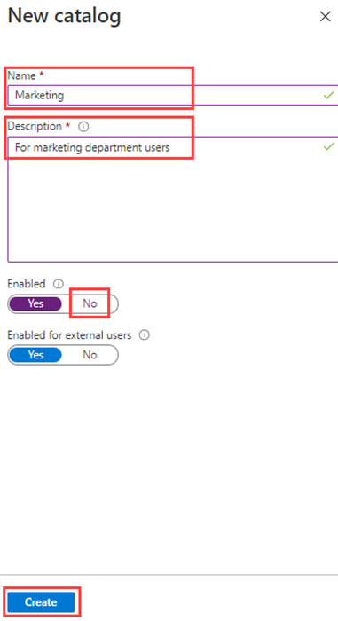
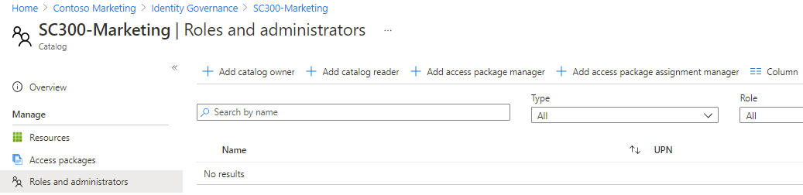

---
lab:
  title: "Erstellen und Verwalten eines Ressourcenkatalogs in der Microsoft\_Entra-Berechtigungsverwaltung"
  learning path: '04'
  module: Module 04 - Plan and Implement and Identity Governance Strategy
---

# Erstellen und Verwalten eines Ressourcenkatalogs in der Microsoft Entra-Berechtigungsverwaltung

## Labszenario

Ein Katalog ist ein Container für Ressourcen und Zugriffspakete. Sie erstellen einen Katalog, wenn Sie zugehörige Ressourcen und Zugriffspakete gruppieren möchten. Der Benutzer, der den Katalog erstellt, ist der erste Katalogbesitzer. Ein Katalogbesitzer kann weitere Katalogbesitzer hinzufügen. Sie müssen einen Katalog in Ihrer Organisation erstellen und konfigurieren.

#### Geschätzte Dauer: 15 Minuten

### Übung 1 – Aufbau von Ressourcen in der Berechtigungsverwaltung

#### Aufgabe 1 – Erstellen eines Katalogs

1. Melden Sie sich mit einem globalen Administratorkonto beim Portal an.

    Um die Microsoft Entra-Richtlinien für Nutzungsbedingungen verwenden und konfigurieren zu können, benötigen Sie Folgendes:
    - Microsoft Entra ID P1-, Premium P2-, EMS E3- oder EMS E5-Abonnement.
    - Wenn Sie über keines dieser Abonnements verfügen, können Sie Microsoft Entra ID Premium erhalten oder die Testversion von Microsoft Entra ID Premium aktivieren.
    - Eines der folgenden Administratorkonten für das Verzeichnis, das Sie konfigurieren möchten:
        - Globaler Administrator
        - Sicherheitsadministrator
        - Administrator für den bedingten Zugriff

2. Öffnen Sie **Microsoft Entra ID** und wählen Sie  **Identity Governance** aus.

3. Wählen Sie im Menü links unter **Berechtigungsverwaltung** die Option **Kataloge** aus.

4. Wählen Sie im oberen Menü die Option **+ Neuer Katalog** aus.

    

5. Geben Sie im Bereich „Neuer Katalog“ im Feld **Name** die Bezeichnung **Marketing** ein.

6. Geben Sie im Feld **Beschreibung** die Angabe **Für Benutzer der Marketingabteilung** ein. Benutzern werden diese Informationen in den Details eines Zugriffspakets angezeigt.

7. Wählen Sie unter **Aktiviert** die Option „Nein“ aus.

- - Die Option **Für externe Benutzer aktiviert** ermöglicht Benutzern in ausgewählten externen Verzeichnissen das Anfordern von Zugriffspaketen in diesem Katalog. An dieser Einstellung werden keine Änderungen vorgenommen.

9. Sie können den Katalog für die sofortige Verwendung aktivieren oder deaktivieren, wenn Sie ihn bis zur beabsichtigten Verwendung stagen oder als nicht verfügbar belassen möchten. Für diese Übung muss der Katalog nicht aktiviert werden.

    

10. Klicken Sie auf Erstellen.

#### Hinzufügen von Ressourcen zu einem Katalog

Um Ressourcen in ein Zugriffspaket einschließen zu können, müssen die Ressourcen in einem Katalog vorhanden sein. Bei den Typen von Ressourcen, die Sie hinzufügen können, handelt es sich um Gruppen, Anwendungen und SharePoint Online-Websites. Die Gruppen können in der Cloud erstellte Microsoft 365-Gruppen oder in der Cloud erstellte Microsoft Entra-Sicherheitsgruppen sein. Die Anwendungen können Microsoft Entra-Unternehmensanwendungen sein, einschließlich SaaS-Anwendungen und Ihrer eigenen Anwendungen, die mit Microsoft Entra ID verbunden sind. Die Websites können SharePoint Online-Websites oder SharePoint Online-Websitesammlungen sein.

1. Wählen Sie auf dem Blatt „Identity Governance“ bei Bedarf die Option **Kataloge** aus.

2. Wählen Sie in der Liste **Kataloge** den Eintrag **Marketing** aus.

3. Wählen Sie im linken Navigationsbereich unter **Verwalten** die Option **Ressourcen** aus.

4. Wählen Sie im Menü die Option **+ Ressourcen hinzufügen** aus.

5. Überprüfen Sie auf dem Bildschirm „Ressourcen zum Katalog hinzufügen“ die verfügbaren Optionen.  Beachten Sie folgende Elemente:

   | Ressourcentyp | Wert |
   | :------------- | :---------- |
   |  Gruppen und Teams | Retail |
   |  **Anwendungen** | Feld |
   |  **Anwendungen** | Salesforce |
   |  **SharePoint-Websites** | Branding von SharePoint <<<Auswahl aus Ihrer Liste der verfügbaren SharePoint-Websites |

6. Sie verfügen möglicherweise nicht über Ressourcen in Gruppen und Teams, Anwendungen oder SharePoint-Websites. Wählen Sie eine beliebige Ressourcenkategorie und dann eine Ressource aus dieser Kategorie aus.

7. Für diese Übung kann eine beliebige verfügbare Ressource ausgewählt werden.

    

8. Wählen Sie abschließend **Hinzufügen** aus. Diese Ressourcen können jetzt in Zugriffspakete im Katalog aufgenommen werden.

#### Hinzufügen weiterer Katalogbesitzer

Der Benutzer, der einen Katalog erstellt hat, ist der erste Katalogbesitzer. Wenn Sie die Verwaltung eines Katalogs delegieren möchten, fügen Sie der Rolle „Katalogbesitzer“ Benutzer hinzu. Dadurch können die Aufgaben der Katalogverwaltung gemeinsam wahrgenommen werden.

1. Navigieren Sie ggf. im Azure-Portal zu **Microsoft Entra ID** > **Identity Governance** > **Kataloge** und wählen Sie anschließend **Marketing** aus.

2. Wählen Sie im Marketingkatalog im linken Navigationsmenü die Option „Rollen und Administratoren“ aus.

    

3. Überprüfen Sie die verfügbaren Rollen im oberen Menü, und wählen Sie dann **+ Besitzer hinzufügen** aus.

4. Wählen Sie im Bereich „Mitglieder auswählen“ Ihr Administratorkonto und dann die Option Auswählen aus.

5. Überprüfen Sie die neu hinzugefügte Rolle in der Liste „Rollen und Administratoren“.

#### Aufgabe 4 – Bearbeiten eines Katalogs

Sie können den Namen und die Beschreibung eines Katalogs bearbeiten. Benutzern werden diese Informationen in den Details eines Zugriffspakets angezeigt.

1. Wählen Sie auf dem Blatt „Marketing“ im linken Navigationsbereich die Option **Übersicht** aus.

2. Wählen Sie im oberen Menü die Option **Bearbeiten** aus.

3. Überprüfen Sie die Einstellung, und wählen Sie unter **Eigenschaften** > **Aktiviert** die Option **Ja** aus.

    

4. Wählen Sie **Speichern**.

#### Zugriffsüberprüfungen für Gastbenutzer

1. Zugriffsüberprüfungen können den Zugriffslebenszyklus verwalten.Microsoft Entra Identity Governance bietet ein Übersichtsdashboard mit dem Status von Zugriffsüberprüfungen. Wählen Sie **im Menü "Identitätsgovernance **" Access-Rezensionen** **aus.

1. Im Menü "Zugriffsüberprüfung" können Sie Access-Rezensionen** auswählen**, um eine Zugriffsüberprüfung für Gastbenutzer zu konfigurieren.Sie wählen **+Neue Zugriffsüberprüfung** aus, um ihre Gastbenutzerzugriffsüberprüfung zu erstellen.Die Kachel wird geöffnet, um die Zugriffsüberprüfung für Gastbenutzer zu konfigurieren.

1. Wählen Sie im Feld **Zu überprüfende Elemente auswählen** die Option **Teams + Gruppen** aus.

1. Wählen Sie unter **"Überprüfungsbereich** auswählen **" alle Microsoft 365-Gruppen mit Gastbenutzern aus.**

1. Wählen Sie unter **"Benutzerbereich** auswählen **" nur** Gastbenutzer aus.

1. Wählen Sie **Weiter: Überprüfungen** aus.

1. Die nächste Kachel ist der Ort, an dem Sie konfigurieren, wer den Zugriff überprüft und genehmigt, wie oft der Zugriff überprüft wird und wann der Zugriff abläuft.

1. Wählen Sie unter **"Prüfer auswählen **" gruppenbesitzer** als diese Prüfer** aus. **Hinweis**: Gastbenutzer sollten ihren eigenen Zugriff nicht als bewährte Identitätsgovernance-Praxis überprüfen dürfen.

1. Geben Sie eine **Dauer (in Tagen)** ein, der Standardwert ist 3, wählen Sie eine Wiederholung **** und ein **Startdatum** für die Rezension aus.

1. Wählen Sie **"Weiter" aus: Einstellungen** und konfigurieren Sie die Einstellungen dafür, wie die Überprüfung stattfindet und was geschieht, wenn der Gastbenutzer antwortet oder nicht reagiert.  Es empfiehlt sich, **die Ergebnisse automatisch auf Ressourcen** anzuwenden und "Zugriff** entfernen" für **"Wenn Prüfer nicht antworten" auszuwählen****. 

1. Wählen Sie Überprüfen + erstellen und dann Erstellen aus, um ein neues virtuelles Netzwerk zu erstellen.

#### Aufgabe 6 – Löschen eines Katalogs

Sie können einen Katalog nur löschen, wenn er keine Zugriffspakete enthält.

1. Wählen Sie auf der Seite „Übersicht“ des Katalogs „Marketing“ im oberen Menü die Option „Löschen“ aus.

2. Überprüfen Sie die Informationen im Dialogfeld „Löschen“, und wählen Sie dann **Ja** aus.

    **Hinweis** : Wir behalten den Katalog für die Verwendung in der nächsten Übung bei.
