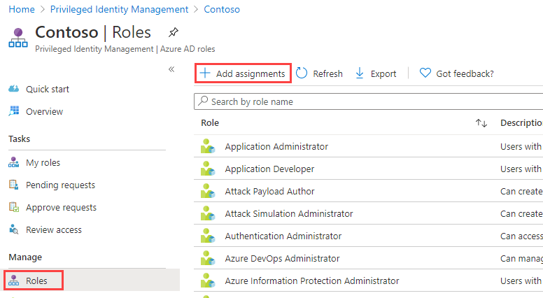

---
lab:
  title: "26: Konfigurieren von Privileged Identity Management für Azure\_AD-Rollen"
  learning path: '04'
  module: Module 04 - Plan and Implement and Identity Governance Strategy
---

# Lab 26: Konfigurieren von Privileged Identity Management für Azure AD-Rollen

## Labszenario

Ein Administrator für privilegierte Rollen kann Privileged Identity Management (PIM) in der Azure AD-Organisation (Azure Active Directory) anpassen und dabei auch die Art und Weise ändern, in der ein Benutzer eine berechtigte Rollenzuweisung aktiviert. Sie müssen sich mit der Konfiguration von PIM vertraut machen.

#### Geschätzte Dauer: 30 Minuten

### Übung 1: Konfigurieren von Einstellungen für Azure AD-Rollen

#### Aufgabe 1: Öffnen der Rolleneinstellungen

Führen Sie die folgenden Schritte aus, um die Einstellungen für eine Azure AD-Rolle zu öffnen.

1. Melden Sie sich bei [https://portal.azure.com](https://portal.azure.com) als globaler Administrator an.

2. Suchen Sie nach **Azure AD Privileged Identity Management**, und wählen Sie es aus.

3. Wählen Sie auf der Seite „Privileged Identity Management“ im linken Navigationsbereich **Azure AD-Rollen** aus.

4. Wählen Sie auf der Seite „Schnellstart“ im linken Navigationsbereich **Einstellungen** aus.

    

5. Überprüfen Sie die Liste der Rollen, und geben Sie anschließend im Feld **Nach Rollenname suchen** den Begriff **Compliance** ein.

6. Wählen Sie in den Ergebnissen die Option **Complianceadministrator** aus.

7. Überprüfen Sie die Detailinformationen der Rolleneinstellungen.

#### Aufgabe 2: Anfordern der Genehmigung zur Aktivierung

Wenn Sie mehrere genehmigende Personen festlegen, ist der Genehmigungsvorgang abgeschlossen, sobald eine dieser Personen die Genehmigung gewährt oder verweigert hat. Sie können keine Genehmigung von mindestens zwei Benutzern erzwingen. Wenn Sie für die Aktivierung einer Rolle eine Genehmigung anfordern möchten, gehen Sie wie folgt vor.

1. Wählen Sie auf der Seite „Details zur Rolleneinstellung“ im oberen Menü **Bearbeiten** aus.

    

2. Aktivieren Sie auf der Seite „Rolleneinstellung bearbeiten – Complianceadministrator“ das Kontrollkästchen **Genehmigung zum Aktivieren anfordern**.

3. Wählen Sie **Genehmigende Personen auswählen** aus.

4. Wählen Sie im Bereich „Mitglied auswählen“ Ihr Administratorkonto aus, und wählen Sie **Auswählen** aus.

    

5. Wählen Sie nach der Konfiguration der Rolleneinstellungen **Aktualisieren** aus, um die Änderungen zu speichern.

### Übung 2: PIM mit Azure AD-Rollen

#### Aufgabe 1: Zuweisen einer Rolle

Mit Azure Active Directory (Azure AD) kann ein globaler Administrator dauerhafte Rollenzuweisungen für Azure AD-Administratoren vornehmen. Diese Rollenzuweisungen können über das Azure-Portal oder über PowerShell-Befehle erstellt werden.

Der Dienst Azure AD Privileged Identity Management (PIM) ermöglicht es auch Administratoren für privilegierte Rollen, permanente Administratorrollen zuzuweisen. Außerdem können Administratoren für privilegierte Rollen Benutzer als für Azure AD-Administratorrollen berechtigt festlegen. Ein berechtigter Administrator kann die Rolle bei Bedarf aktivieren, und die entsprechenden Berechtigungen laufen nach einem bestimmten Zeitraum ab.

Führen Sie folgende Schritte aus, um einen Benutzer als für eine Azure AD-Administratorrolle „berechtigt“ festzulegen.

1. Melden Sie sich mit einem globalen Administratorkonto bei [https://portal.azure.com](https://portal.azure.com) an.

2. Suchen Sie nach **Azure AD Privileged Identity Management**, und wählen Sie es aus.

3. Wählen Sie auf der Seite „Privileged Identity Management“ im linken Navigationsbereich **Azure AD-Rollen** aus.

4. Wählen Sie auf der Seite „Schnellstart“ im linken Navigationsbereich **Rollen** aus.

5. Wählen Sie im oberen Menü **+ Zuweisungen hinzufügen** aus.

    

6. Überprüfen Sie die Einstellungen auf der Seite „Zuweisungen hinzufügen“ auf der Registerkarte **Mitgliedschaft**.

7. Wählen Sie das Menü **Rolle auswählen** aus, und wählen Sie dann **Complianceadministrator** aus.

8. Mithilfe des Felds **Nach Rollenname suchen** können Sie nach einer Rolle suchen.

9. Wählen Sie unter **Mitglied(er) auswählen** die Option **Keine Mitglieder ausgewählt** aus.

10. Wählen Sie im Bereich „Mitglied auswählen“ **Miriam Graham** und dann **Auswählen** aus.

    

11. Wählen Sie auf der Seite „Zuweisungen hinzufügen“ die Option **Weiter** aus.

12. Überprüfen Sie auf der Registerkarte **Einstellungen** unter **Zuweisungstyp** die verfügbaren Optionen. Verwenden Sie für diese Aufgabe die Standardeinstellung.

    - Für berechtigte Zuweisungen muss das Mitglied der Rolle eine Aktion durchführen, um die Rolle verwenden zu können. Beispiele für Aktionen sind eine erfolgreiche Überprüfung der Multi-Faktor-Authentifizierung (MFA), die Angabe einer geschäftlichen Begründung oder das Anfordern einer Genehmigung von den angegebenen genehmigenden Personen.
    - Für aktive Zuweisungen ist es nicht erforderlich, dass das Mitglied eine Aktion durchführt, um die Rolle nutzen zu können. Bei als aktiv zugewiesenen Mitgliedern sind die Berechtigungen immer der Rolle zugewiesen.

13. Überprüfen Sie die restlichen Einstellungen, und wählen Sie dann **Zuweisen** aus.

#### Aufgabe 2: Anmelden als Miriam

1. Öffnen Sie ein neues InPrivate-Browserfenster.
2. Stellen Sie eine Verbindung mit dem Azure-Portal (https://portal.azure.com) her.
3. Wenn das Portal mit einem angemeldeten Benutzer geöffnet wird, wählen Sie in der rechten oberen Ecke dessen Namen und dann **Mit einem anderen Konto anmelden** aus.
4. Melden Sie sich als Miriam an.

   | Feld | Wert |
   | :--- | :--- |
   | Benutzername | **MiriamG@** `<<your domain.onmicrosoft.com>>` |
   | Kennwort |  Geben Sie das Administratorkennwort des Mandanten ein (Sie finden das Kennwort des Mandantenadministrators auf der Registerkarte „Labressourcen“). |

5. Schließen Sie das **Dialogfeld „Willkommen bei Azure“**.
6. Suchen Sie in der Leiste **Ressourcen, Dienste und Dokumente durchsuchen** nach Azure Active Directory, und öffnen Sie die Seite.
7. Suchen Sie auf der Seite **Übersicht** nach **Mein Feed**.
8. Wählen Sie **Profil anzeigen** unter Miriam Grahams Namen aus. Dadurch wird die Profilseite von Miriam geöffnet.
9. Wählen Sie **Zugewiesene Rollen** und dann **Berechtigte Zuweisungen** aus.
10. Beachten Sie, dass die Rolle **Complianceadministrator** jetzt für Miriam verfügbar ist.

#### Aufgabe 3: Aktivieren der Azure AD-Rollen

Wenn Sie eine Azure AD-Rolle annehmen müssen, können Sie in Privileged Identity Management die Aktivierung anfordern, indem Sie die Option **Meine Rollen** öffnen.

1. Suchen Sie in der Leiste **Ressourcen, Dienste und Dokumente durchsuchen** nach „Privileged“.
2. Öffnen Sie die Seite **Azure AD Privileged Identity Management**.
3. Wählen Sie auf der Seite „Privileged Identity Management“ im linken Navigationsmenü **Meine Rollen** aus.

4. Überprüfen Sie auf der Seite „Meine Rollen“ die Liste der berechtigten Zuweisungen.

    

5. Wählen Sie in der Zeile der Rolle „Complianceadministrator“ die Option **Aktivieren** aus.

6. Wählen Sie im Bereich „Aktivieren – Complianceadministrator“ die Option **Zusätzliche Überprüfung erforderlich** aus, und führen Sie dann die Schritte zur Bereitstellung einer zusätzlichen Sicherheitsüberprüfung aus. Sie müssen sich nur einmal pro Sitzung authentifizieren.

    

    **Überprüfung**: Basierend auf unserer aktuellen Konfiguration der Labumgebung müssen Sie MFA konfigurieren und sich erfolgreich anmelden.

7. Geben Sie nach Abschluss der zusätzlichen Sicherheitsüberprüfung im Bereich „Aktivieren – Complianceadministrator“ im Feld **Grund** den Text **Das ist meine Begründung für die Aktivierung dieser Rolle** ein.

    **Wichtiger Hinweis**: Gehen Sie nach dem Prinzip der geringsten Rechte vor: Sie sollten das Konto nur so lange aktivieren, wie Sie es benötigen.  Wenn die erforderlich Arbeit nur 1,5 Stunden dauert, dann legen Sie die Dauer auf zwei Stunden fest.  Wenn Sie wissen, dass Sie die Arbeit erst nach 15:00 Uhr ausführen können, wählen Sie eine benutzerdefinierte Aktivierungszeit aus.

8. Wählen Sie **Aktivieren** aus.

#### Aufgabe 4: Zuweisen einer Rolle mit eingeschränktem Bereich

Bei bestimmten Rollen kann der Bereich der erteilten Berechtigungen auf eine einzelne Verwaltungseinheit, einen Dienstprinzipal oder eine Anwendung beschränkt werden. Dieses Verfahren ist ein Beispiel für die Zuweisung einer Rolle, die den Bereich einer Verwaltungseinheit aufweist.

1. Denken Sie daran, die Browserfenster für MiriamG zu schließen, und öffnen Sie dann das Azure-Portal mit Ihrem Administratorkonto.
2. Navigieren Sie zur Seite „Privileged Identity Management“, und wählen Sie im linken Navigationsmenü **Azure AD-Rollen** aus.
3. Wählen Sie **Rollen** aus.
4. Wählen Sie auf der Seite „Rollen“ im oberen Menü **+ Zuweisungen hinzufügen** aus.

5. Wählen Sie auf der Seite „Zuweisungen hinzufügen“ unter **Rolle auswählen** die Option **Benutzeradministrator** aus.

6. Wählen Sie das Menü **Bereichstyp** aus, und überprüfen Sie die verfügbaren Optionen. Wählen Sie für die Übung den Bereichstyp **Verzeichnis** aus.

   **Tipp**: Weitere Informationen zum Bereichstyp „Administrative Einheit“ finden Sie unter [https://docs.microsoft.com/en-us/azure/active-directory/roles/admin-units-manage](https://docs.microsoft.com/en-us/azure/active-directory/roles/admin-units-manage).

7. Hier können Sie später, wie schon beim Zuweisen einer Rolle ohne Bereichseinschränkung, Mitglieder hinzufügen und die Einstellungsoptionen abschließen. Wählen Sie für den Moment jedoch **Abbrechen** aus.

#### Aufgabe 5: Aktualisieren oder Entfernen einer vorhandenen Rollenzuweisung

Befolgen Sie diese Anweisungen zum Aktualisieren oder Entfernen einer vorhandenen Rollenzuweisung.

1. Wählen Sie auf der Seite „Azure AD Privileged Identity Management > Azure AD-Rollen“ im linken Navigationsbereich **Zuweisungen** aus.

2. Überprüfen Sie in der Liste **Zuweisungen** unter „Complianceadministrator“ die Optionen in der Spalte **Aktion**.

    

3. Wählen Sie **Aktualisieren** aus, und überprüfen Sie die im Bereich „Mitgliedschaftseinstellungen“ verfügbaren Optionen. Wenn Sie fertig sind, schließen Sie den Bereich.

4. Wählen Sie **Entfernen**.

5. Überprüfen Sie im Dialogfeld **Entfernen** die Informationen, und wählen Sie **Ja** aus.
