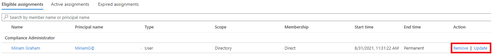

---
lab:
  title: Konfigurieren des Privileged Identity Management für Microsoft Entra-Rollen
  learning path: '04'
  module: Module 04 - Plan and Implement and Identity Governance Strategy
---

# Konfigurieren des Privileged Identity Management für Microsoft Entra-Rollen

## Labszenario

Ein Administrator für privilegierte Rollen kann Azure AD Privileged Identity Management (PIM) in der Organisation anpassen und hierbei auch die Art und Weise ändern, in der ein Benutzer eine berechtigte Rollenzuweisung aktiviert. Sie müssen sich mit der Konfiguration von PIM vertraut machen.

#### Geschätzte Dauer: 30 Minuten

### Konfigurieren von Microsoft Entra-Rolleneinstellungen

#### Aufgabe 1 – Rolleneinstellungen öffnen

Befolgen Sie diese Schritte, um die Einstellungen für eine Microsoft Entra-Rolle zu öffnen.

1. Melden Sie sich als globaler Administrator an.

2. Suchen Sie nach **Azure AD Privileged Identity Management**, und wählen Sie es aus.

3. Klicken Sie auf dem Bildschirm „Privileged Identity Management“ im linken Navigationsbereich auf **Microsoft Entra-Rollen**.

4. Klicken Sie auf der Seite „Schnellstart“ im linken Navigationsbereich auf **Einstellungen**.

    

5. Überprüfen Sie die Liste der Rollen, und geben Sie anschließend im Feld **Nach Rollenname suchen** den Begriff **Compliance** ein.

6. Wählen Sie in den Ergebnissen die Option **Complianceadministrator** aus.

7. Überprüfen Sie die Detailinformationen der Rolleneinstellungen.

#### Erzwingen der Genehmigung für die Aktivierung

Wenn Sie mehrere genehmigende Personen festlegen, ist der Genehmigungsvorgang abgeschlossen, sobald eine dieser Personen die Genehmigung gewährt oder verweigert hat. Sie können keine Genehmigung von mindestens zwei Benutzern erzwingen. Wenn Sie für die Aktivierung einer Rolle eine Genehmigung anfordern möchten, gehen Sie wie folgt vor.

1. Klicken Sie auf der Seite „Details zur Rolleneinstellung“ im oberen Menü auf **Bearbeiten**.

    

2. Aktivieren Sie auf dem Bildschirm „Rolleneinstellung bearbeiten – Complianceadministrator“ das Kontrollkästchen **Genehmigung zum Aktivieren anfordern**.

3. Wählen Sie **Genehmigende Personen auswählen** aus.

4. Wählen Sie im Bereich „Mitglied auswählen“ Ihr Administratorkonto aus, und klicken Sie auf **Auswählen**.

    

5. Klicken Sie nach der Konfiguration der Rolleneinstellungen auf **Aktualisieren**, um die Änderungen zu speichern.

### Übung 2 – PIM mit Microsoft Entra-Rollen

#### Aufgabe 1 – Zuweisen einer Rolle

Mit Microsoft Entra ID können globale Administrator*innen permanente Microsoft Entra Administratorrollenzuweisungen vornehmen. Diese Rollenzuweisungen können mithilfe des Microsoft Entra Admin Centers oder mithilfe von PowerShell-Befehlen erstellt werden.

Der Dienst Azure AD Privileged Identity Management (PIM) ermöglicht es auch Administratoren für privilegierte Rollen, dauerhafte Administratorrollen zuzuweisen. Außerdem können Administrator*innen für privilegierte Rollen Benutzer*innen als für Microsoft Entra-Administratorrollen berechtigt festlegen. Ein berechtigter Administrator kann die Rolle bei Bedarf aktivieren, und die entsprechenden Berechtigungen laufen nach einem bestimmten Zeitraum ab.

Führen Sie folgende Schritte aus, um Benutzer*innen als für eine Microsoft Entra-Administratorrolle berechtigt festzulegen.

1. Melden Sie sich mit einem globalen Administratorkonto beim Portal an.

2. Suchen Sie nach **Azure AD Privileged Identity Management**, und wählen Sie es aus.

    **Hinweis** : Sie finden sie im Menü unter Identity - Identity Governance - Privileged Identity Management.

3. Klicken Sie auf dem Bildschirm „Privileged Identity Management“ im linken Navigationsbereich auf **Microsoft Entra-Rollen**.

4. Klicken Sie auf der Seite „Schnellstart“ im linken Navigationsbereich auf **Rollen**.

5. Klicken Sie im oberen Menü auf **Zuweisungen hinzufügen**.

    

6. Überprüfen Sie die Einstellungen auf dem Blatt „Zuweisungen hinzufügen“ auf der Registerkarte **Mitgliedschaft**.

7. Wählen Sie das Menü **Rolle auswählen** aus, und klicken Sie dann auf **Complianceadministrator**.

8. Mithilfe des Felds **Nach Rollenname suchen** können Sie nach einer Rolle suchen.

9. Wählen Sie unter **Mitglied(er) auswählen** die Option **Keine Mitglieder ausgewählt** aus.

10. Wählen Sie **im Bereich "Mitglied auswählen" Miriam Graham** und dann " **Auswählen"** aus.

    

11. Klicken Sie auf dem Blatt „Zuweisungen hinzufügen“ auf **Weiter**.

12. Überprüfen Sie auf der Registerkarte **Einstellungen** unter **Zuweisungstyp** die verfügbaren Optionen. Verwenden Sie für diese Aufgabe die Standardeinstellung.

    - Für berechtigte Zuweisungen muss das Mitglied der Rolle eine Aktion durchführen, um die Rolle verwenden zu können. Beispiele für Aktionen sind eine erfolgreiche Multi-Factor Authentication-Überprüfung (MFA), die Angabe einer geschäftlichen Begründung oder das Anfordern einer Genehmigung von den angegebenen genehmigenden Personen.
    - Für aktive Zuweisungen ist es nicht erforderlich, dass das Mitglied eine Aktion durchführt, um die Rolle nutzen zu können. Bei als aktiv zugewiesenen Mitgliedern sind die Berechtigungen immer der Rolle zugewiesen.

13. Überprüfen Sie die restlichen Einstellungen, und klicken Sie dann auf **Zuweisen**.

#### Vorgang 2 – Melden Sie sich mit Miriam an

1. Öffnen Sie ein Browserfenster im InPrivate-Modus.
2. Melden Sie sich beim Microsoft Entra Admin Center an.
    **Hinweis** : Wenn es mit einem angemeldeten Benutzer geöffnet wird, wählen Sie in der oberen rechten Ecke ihren Namen aus, und wählen Sie " **Als anderes Konto** anmelden" aus.
3. Melden Sie sich bei miriam an.

   | Feld | Wert |
   | :--- | :--- |
   | Username | MiriamG |
   | Kennwort |  Geben Sie das Administratorkennwort des Mandanten ein(Verweisen Sie auf die Registerkarte "Lab-Ressourcen", um das Kennwort des Mandantenadministrators abzurufen) |

4. Öffnen Sie im **Menü "Identität**" "Benutzer **", und wählen Sie dann "Alle Benutzer **" aus**.**
5. Suchen von **Miriam** in der Liste der Benutzer
6. Suchen Sie auf der **Seite "Übersicht** " nach den **zugewiesenen Rollen**.
7. 1. **Gewähren der berechtigten Zuweisungen**
1. Beachten Sie, dass die Rolle " **Complianceadministrator** " jetzt für Miriam verfügbar ist.

#### Aktivieren Ihrer Microsoft Entra-Rollen

Wenn Sie eine Microsoft Entra-Rolle annehmen müssen, können Sie in Privileged Identity Management die Aktivierung anfordern, indem Sie die Option **Meine Rollen** öffnen.

1. Suchen Sie in der **Leiste "Suchen", "Ressourcen", "Dienste" und "** Dokumente" nach "Privileged".
2. Öffnen Sie **Privileged Identity Management**.
3. Klicken Sie auf dem Bildschirm „Privileged Identity Management“ im linken Navigationsmenü auf **Meine Rollen**.

4. Überprüfen Sie im Bereich „Meine Rollen“ die Liste der berechtigten Zuweisungen.

    

5. Wählen Sie in der Zeile der Rolle „Complianceadministrator“ die Option **Aktivieren** aus.

6. Klicken Sie im Bereich „Aktivieren – Complianceadministrator“ auf die Option **Zusätzliche Überprüfung erforderlich**, und führen Sie dann die Schritte zur Bereitstellung einer zusätzlichen Sicherheitsüberprüfung aus. Sie müssen sich nur einmal pro Sitzung authentifizieren.

    

    **Überprüfung** – Basierend auf unserer aktuellen Konfiguration der Laborumgebung müssen Sie MFA konfigurieren und sich erfolgreich anmelden.

7. Geben Sie nach Abschluss der zusätzlichen Sicherheitsüberprüfung im Bereich „Aktivieren – Complianceadministrator“ im Feld Gründe eine Begründung für die Aktivierung dieser Rolle ein.

    **Wichtiger Hinweis** - der Prinzipal der geringsten Prvilege, sollten Sie das Konto nur für den Zeitraum aktivieren, den Sie benötigen.  Wenn die Arbeit erforderlich ist, dauert es nur 1,5 Stunden, und legen Sie die Dauer auf zwei Stunden fest.  Wenn Sie wissen, dass Sie die Arbeit erst nach 13:00 Uhr ausführen können, wählen Sie eine benutzerdefinierte Aktivierungszeit aus.

8. Wählen Sie **Aktivieren**aus.

#### Zuweisen einer Rolle mit eingeschränktem Bereich

Bei bestimmten Rollen kann der Bereich der erteilten Berechtigungen auf eine einzelne Verwaltungseinheit, einen Dienstprinzipal oder eine Anwendung beschränkt werden. Dieses Verfahren ist ein Beispiel für die Zuweisung einer Rolle, die den Bereich einer Verwaltungseinheit aufweist.

1. Denken Sie daran, die Browserfenster für MiriamG zu schließen, und öffnen Sie dann das Microsoft Entra Admin Center mit Ihrem Administratorkonto.
2. Navigieren Sie zum Bildschirm „Privileged Identity Management“, und wählen Sie im linken Navigationsmenü **Microsoft Entra-Rollen** aus.
3. Wählen Sie **Rollen** aus.
4. Klicken Sie im Bereich „Rollen“ im oberen Menü auf **+ Zuweisungen hinzufügen**.

5. Wählen Sie auf dem Blatt „Zuweisungen hinzufügen“ unter **Rolle auswählen** die Option **Benutzeradministrator** aus.

6. Klicken Sie auf das Menü **Bereichstyp**, und überprüfen Sie die verfügbaren Optionen. Wählen Sie für die Übung den Bereichstyp **Verzeichnis** aus.

   **Tipp** : Weitere [https://docs.microsoft.com/en-us/azure/active-directory/roles/admin-units-manage](https://docs.microsoft.com/en-us/azure/active-directory/roles/admin-units-manage) Informationen zum Bereichstyp der administrativen Einheit.

7. Hier können Sie später, wie schon beim Zuweisen einer Rolle ohne Bereichseinschränkung, Mitglieder hinzufügen und die Einstellungsoptionen abschließen. Klicken Sie für den Moment jedoch auf **Abbrechen**.

#### Aktualisieren oder Entfernen einer vorhandenen Rollenzuweisung

Befolgen Sie diese Anweisungen zum Aktualisieren oder Entfernen einer vorhandenen Rollenzuweisung.

1. Wählen Sie auf dem Bildschirm „Microsoft Entra Privileged Identity Management öffnen > Microsoft Entra-Rollen“ im linken Navigationsbereich **Zuweisungen** aus.

2. Überprüfen Sie in der Liste **Zuweisungen** unter „Complianceadministrator“ die Optionen in der Spalte **Aktion**.

    

3. Wählen Sie **Aktualisieren** aus, und überprüfen Sie die im Bereich „Mitgliedschaftseinstellungen“ verfügbaren Optionen. Wenn Sie fertig sind, schließen Sie den Bereich.

4. Wählen Sie **Entfernen**.

5. Überprüfen Sie im Dialogfeld **Entfernen** die Informationen, und klicken Sie auf **Ja**.
